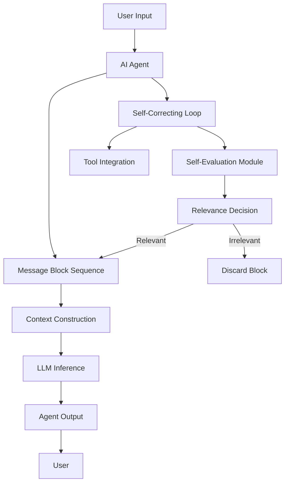
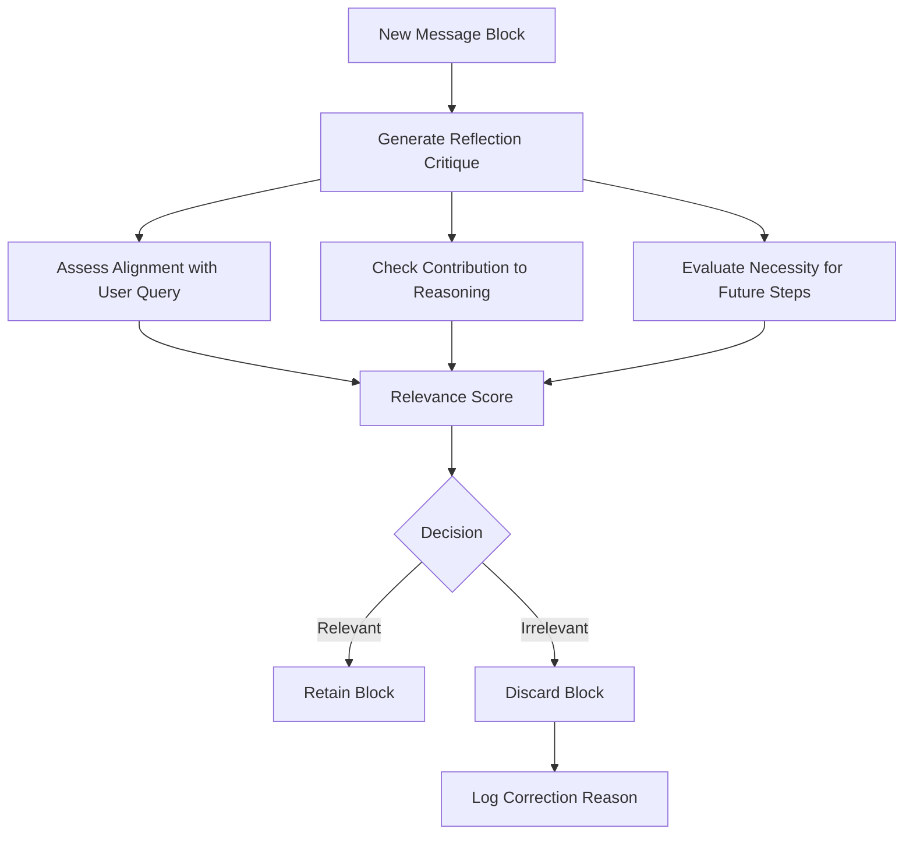
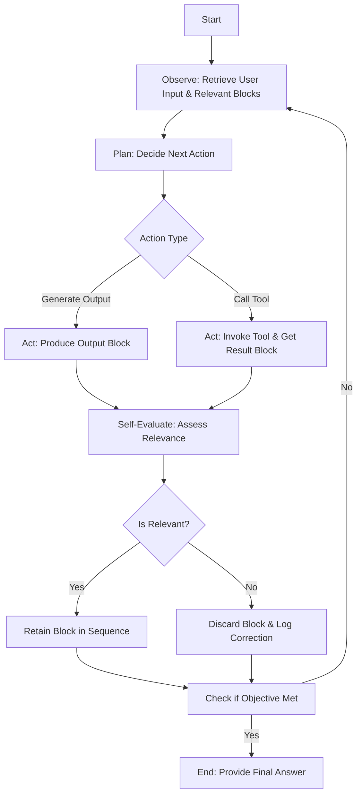
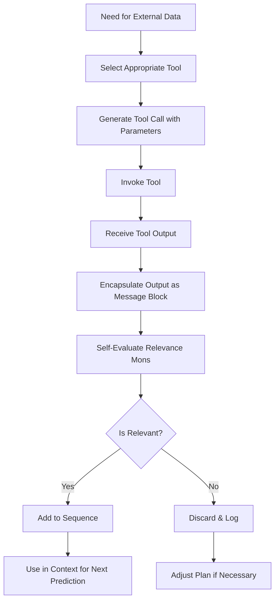
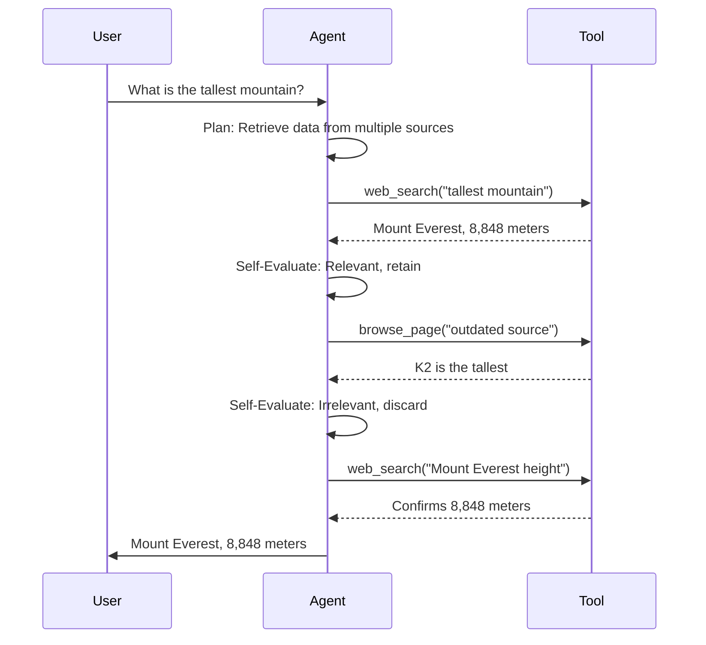

# AI Agent with Autonomous Relevance-Based Self-Correction

## 1. Introduction

The AI agent with autonomous relevance-based self-correction is designed to autonomously evaluate and correct its outputs by assessing their relevance to user objectives. By maintaining a sequence of message blocks—representing agent actions or tool results—and using self-reflection to filter out irrelevant information, the agent enhances inference quality, reduces computational costs, and ensures transparency. The system leverages a Large Language Model (LLM), such as GPT-4, and integrates external tools to provide accurate and efficient responses.

## 2. Objective

The AI agent aims to:
- Autonomously evaluate each message block for relevance to the user’s goal.
- Discard or skip irrelevant information based on its own judgment.
- Embed a self-correcting mechanism to improve accuracy and efficiency.
- Provide transparent, auditable reasoning paths for debugging and evaluation.

## 3. Motivation

The development of this agent is driven by:
- **Autonomy and Self-Correction:** Mimics human metacognition to reduce errors without external intervention [1][2].
- **Cost Efficiency:** Minimizes token usage in LLMs, lowering inference costs.
- **Transparency:** Provides auditable correction logs for trust and debuggability.
- **Reliability:** Reduces error propagation for high-quality responses.

## 4. System Architecture

The system comprises interconnected components, as shown in **Figure 1: High-Level System Architecture**. User input flows into the AI agent, which processes it through a self-correcting loop, integrates tools, and constructs a context for LLM inference.



**Figure 1: High-Level System Architecture** – Illustrates the flow of user input through the agent, message block sequence, self-correcting loop, and tool integration to produce an output.

### 4.1 Message Block Sequence
- **Definition:** A message block is a structured unit containing:
  - **Content:** Text from the agent or tool output.
  - **Metadata:** Unique ID, timestamp, source (agent or tool), relevance status.
- **Storage:** Indexed list (in-memory for speed) or SQLite database (for persistence).
- **Management:** Blocks are added chronologically, retrieved for context, or deleted if irrelevant.

### 4.2 Autonomous Relevance Evaluation
- **Process:** The agent generates a reflection critique for each new block using prompts like, “Does this block contribute to the user’s goal?”
- **Techniques:** Semantic similarity (using Sentence Transformers) and keyword matching (using TF-IDF) to compute a relevance score (threshold > 0.7 for retention).
- **Actions:** Retain relevant blocks; discard and log irrelevant ones (e.g., “Discarded block ID 123: unrelated to query”).



**Figure 2: Self-Evaluation Module Diagram** – Depicts the process of evaluating a message block’s relevance through reflection and scoring.

### 4.3 Self-Correcting Loop
The agent operates in a continuous loop, as shown in **Figure 3: Self-Correcting Loop Flowchart**:
1. **Observe:** Retrieve user input and relevant blocks.
2. **Plan:** Decide the next action (generate output or call tool).
3. **Act:** Produce an output block or invoke a tool.
4. **Self-Evaluate:** Assess the new block’s relevance.
5. **Iterate:** Continue until the objective is met.



**Figure 3: Self-Correcting Loop Flowchart** – Shows the iterative process of observing, planning, acting, and evaluating.

**Pseudocode:**
```python
while not objective_met:
    context = get_relevant_blocks()
    action = plan_next_action(context)
    if action == 'generate_output':
        output = generate_response(context)
        block = create_block(output, 'agent')
    elif action == 'call_tool':
        tool_result = invoke_tool(tool_name, parameters)
        block = create_block(tool_result, 'tool')
    reflection = reflect_on_block(block)
    if is_relevant(reflection, threshold=0.7):
        add_to_sequence(block)
    else:
        log_correction(block, reflection)
    if check_objective_met():
        break
```

### 4.4 Tool Integration
- **Available Tools:** `web_search` (general information), `browse_page` (specific URL content), `x_search` (social media insights), `google_maps` (location data), `sports_api`, `finance_api`.
- **Process:** Select tool based on query, invoke with parameters, encapsulate result as a block.



**Figure 4: Tool Integration Flowchart** – Outlines tool selection, invocation, and relevance evaluation.

### 4.5 Context Construction
- **Process:** Concatenate user query and relevant blocks, respecting LLM token limits (e.g., 4096 tokens).
- **Optimization:** Summarize older blocks to maintain concise context.

## 5. Operational Examples

### 5.1 Simple Query
- **User:** “What is the capital of France?”
- **Agent:** Plans to confirm with a tool.
- **Tool:** `web_search("capital of France")` → “Paris is the capital of France.”
- **Self-Evaluation:** “Aligns with query, necessary.” → Retain.
- **Agent:** “The capital of France is Paris.”

### 5.2 Error Correction
- **User:** “What is the age of the current US president?”
- **Agent:** Plans to identify president and birthdate.
- **Tool:** `web_search("current US president")` → “Joe Biden” (July 9, 2025).
- **Self-Evaluation:** Relevant → Retain.
- **Tool:** `web_search("Joe Biden birthdate")` → “November 20, 1942.”
- **Self-Evaluation:** Relevant → Retain.
- **Mistake:** `web_search("Donald Trump birthdate")` → “June 14, 1946.”
- **Self-Evaluation:** “Irrelevant: not current president.” → Discard.
- **Agent:** Calculates age: Joe Biden is 82 years old.

### 5.3 Handling Conflicting Information
- **User:** “What is the tallest mountain in the world?”
- **Agent:** Plans to retrieve data from multiple sources.
- **Tool:** `web_search("tallest mountain")` → “Mount Everest, 8,848 meters.”
- **Self-Evaluation:** Relevant → Retain.
- **Tool:** `browse_page("outdated source")` → “K2 is the tallest mountain.”
- **Self-Evaluation:** “Conflicts with Everest data; outdated.” → Discard.
- **Tool:** `web_search("Mount Everest height")` → “8,848 meters.”
- **Agent:** “The tallest mountain is Mount Everest, 8,848 meters.”



**Figure 5: Sequence Diagram for Conflicting Information** – Shows how the agent resolves discrepancies.

### 5.4 Ambiguous Query
- **User:** “Tell me about the history of AI.”
- **Agent:** Plans to retrieve information on AI history.
- **Tool:** `web_search("history of AI")` → “AI development began in the 1950s...”
- **Self-Evaluation:** Relevant → Retain.
- **Tool:** `browse_page("AI in pop culture")` → “AI in movies like The Matrix...”
- **Self-Evaluation:** “Interesting but not directly relevant to history.” → Discard.
- **Agent:** Summarizes key historical milestones in AI development.

## 6. Self-Evaluation Mechanisms
- **Reflection Prompts:** Examples include:
  - “Does this block advance the user’s goal?”
  - “Is this information consistent with prior blocks?”
- **Relevance Scoring:** Combines semantic similarity (using embeddings) and keyword analysis; blocks scoring below 0.7 are discarded.
- **Error Handling:** Detects factual inaccuracies or tool failures, triggering re-issued tool calls or alternative queries.

## 7. Benefits and Trade-offs

| **Aspect**          | **Benefit**                                          | **Trade-off**                                      |
|---------------------|-----------------------------------------------------|------------------------------------------------|
| **Accuracy**        | Filtering noise improves reasoning quality.         | Risk of discarding relevant data.              |
| **Cost Efficiency** | Reduced token usage lowers LLM inference costs.     | Evaluation adds computational overhead.         |
| **Transparency**    | Auditable correction logs enhance trust.            | Increased system complexity.                    |
| **Self-Correction** | Reduces error propagation.                         | Potential over-correction in complex tasks.     |

## 8. Challenges and Limitations
- **Incorrect Judgments:** The agent may misjudge relevance, discarding critical data or retaining noise.
  - **Mitigation:** Use confidence thresholds; allow teammate retention for re-evaluation.
- **Computational Overhead:** Reflection increases processing time.
  - **Mitigation:** Optimize evaluation frequency or use heuristics for simple blocks.
- **Conflicting Information:** Multiple sources may provide contradictory data.
  - **Mitigation:** Prioritize reliable sources (e.g., verified websites) and cross-verify.

## 9. Performance Metrics
- **Accuracy:** Measure correct answers against ground truth.
- **Efficiency:** Track token usage reduction (e.g., 20% fewer tokens).
- **Response Time:** Monitor impact of self-evaluation on latency.
- **User Satisfaction:** Collect feedback on response quality.

## 10. Implementation Considerations
- **LLM:** GPT-4 for advanced reasoning and reflection.
- **Storage:** In-memory lists for small-scale use; SQLite for multi-user scenarios.
- **Tool APIs:** Integrate reliable services (e.g., Google Search API); handle rate limits and errors.
- **Optimization:** Limit evaluation cycles to balance accuracy and speed.

## 11. Ethical Considerations
- **Data Privacy:** Do not store sensitive user data; clear session data after use.
- **Misinformation:** Verify information from multiple reputable sources.
- **Bias:** Implement checks to avoid biased content, using neutral language and diverse sources.

## 12. Future Work
- **Learning from Feedback:** Incorporate user corrections to refine relevance criteria.
- **Advanced Reasoning:** Explore reinforcement learning for dynamic decision-making.
- **Scalability:** Support multi-user sessions with efficient resource management.

## 13. References
- [1] Galileo AI Blog: Mastering Agents. https://galileo.ai/blog/mastering-agents-evaluating-ai-agents
- [2] Galileo AI Blog: Self-Evaluation in AI Agents. https://galileo.ai/blog/self-evaluation-ai-agents-performance-reasoning-reflection
- [3] Fonzi AI: Self-Evaluating AI Feedback. https://fonzi.ai/blog/self-evaluating-ai-feedback
- [4] Arize: Agent Evaluation. https://arize.com/ai-agents/agent-evaluation/
- [5] Toloka AI: AI Agent Evaluation Methodologies. https://toloka.ai/blog/ai-agent-evaluation-methodologies-challenges-and-emerging-standards/
- [6] LinkedIn: Reflection in AI Agents. https://www.linkedin.com/pulse/reflection-ai-agents-enhancing-performance-through-sidhaiyan-f3evc
- [7] HelloTars: AI Self-Evaluation. https://hellotars.com/blog/what-is-ai-self-evaluation-an-overview-of-assessing-and-improving-ai-responses
- [8] Relevance AI: Performance Evaluation of AI Agents. https://relevanceai.com/agent-templates-tasks/performance-evaluation-ai-agents
- [9] Microsoft Tech Community: AI Agents Metacognition. https://techcommunity.microsoft.com/blog/educatordeveloperblog/ai-agents-metacognition-for-self-aware-intelligence---part-9/4402253
- [10] Newline: Correcting AI Agents. https://www.newline.co/@LouisSanna/self-correcting-ai-agents-how-to-build-ai-that-learns-from-its-mistakes--414dc7ad
- [11] Medium: Can AI Agents Self-Correct? https://medium.com/@jianzhang_23841/can-ai-agents-self-correct-43823962af92
- [12] Medium: Training AI Agents to Self-Correct. https://medium.com/@avd.sjsu/training-ai-agents-to-self-correct-a-deep-dive-into-agent-rs-theoretical-foundations-1c6d00fecdf6

## 14. Appendices

### Glossary
- **LLM:** Large Language Model, e.g., GPT-4.
- **Message Block:** A structured unit containing content and metadata.
- **Self-Correction:** The agent’s process of evaluating and refining its outputs.