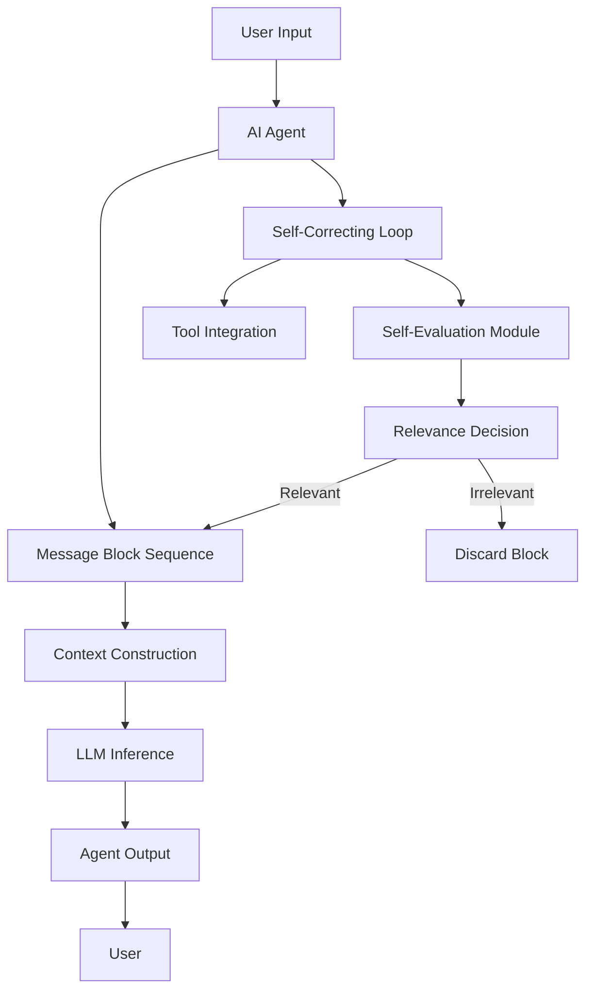
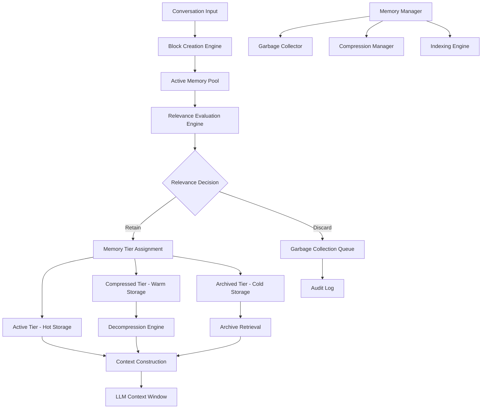
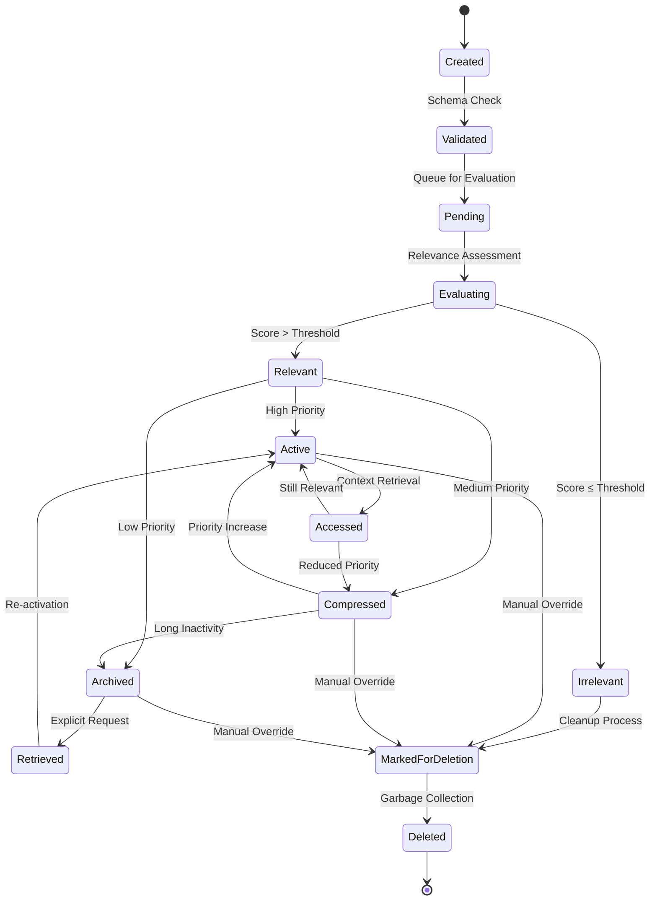
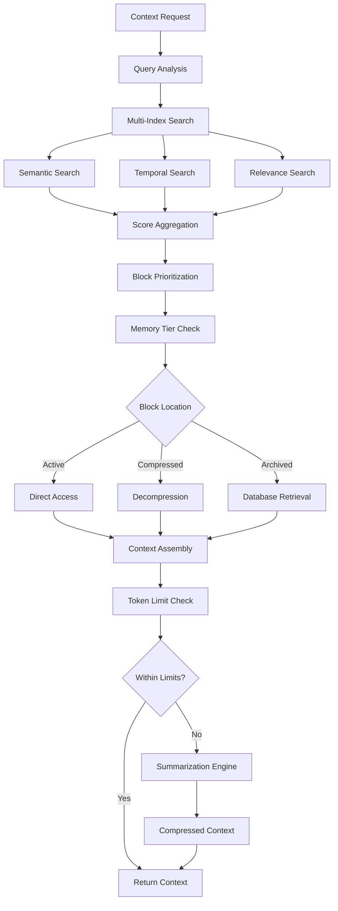
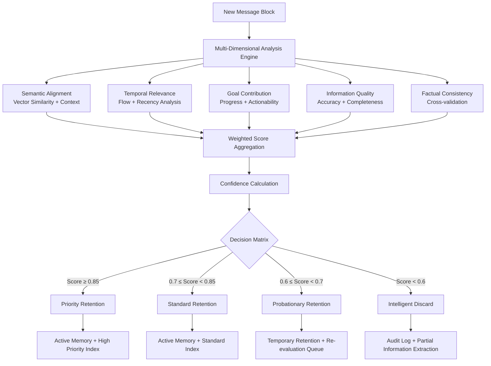
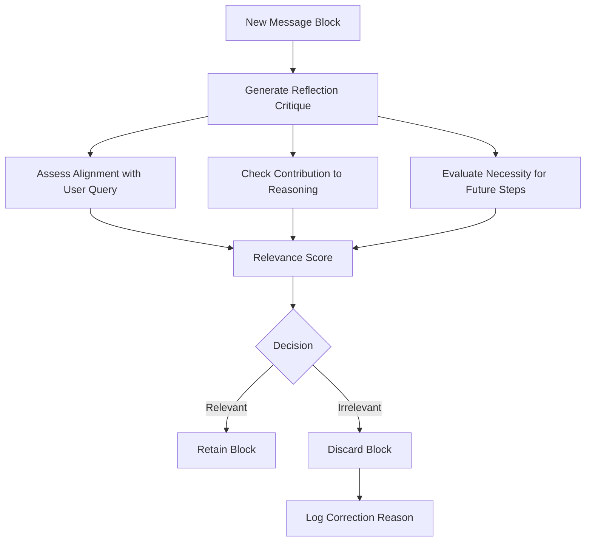
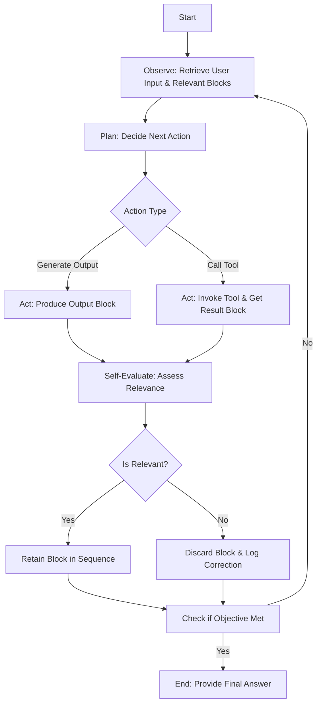
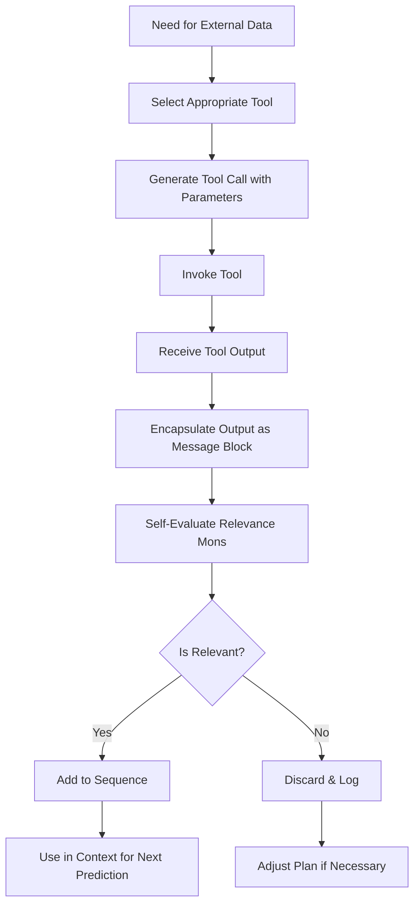
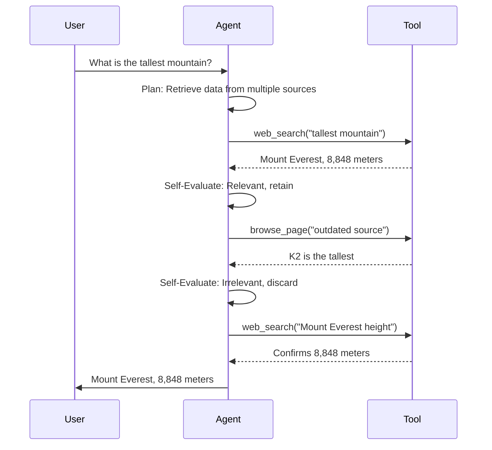

# AI Agent with Autonomous Relevance-Based Self-Correction

## 1. Introduction

The AI agent with autonomous relevance-based self-correction is designed to autonomously evaluate and correct its outputs by assessing their relevance to user objectives. By maintaining a sequence of message blocks—representing agent actions or tool results—and using self-reflection to filter out irrelevant information, the agent enhances inference quality, reduces computational costs, and ensures transparency. The system leverages a Large Language Model (LLM), such as GPT-4, and integrates external tools to provide accurate and efficient responses.

## 2. Objective

The AI agent aims to:
- Autonomously evaluate each message block for relevance to the user’s goal.
- Discard or skip irrelevant information based on its own judgment.
- Embed a self-correcting mechanism to improve accuracy and efficiency.
- Provide transparent, auditable reasoning paths for debugging and evaluation.

## 3. Motivation

The development of this agent is driven by:
- **Autonomy and Self-Correction:** Mimics human metacognition to reduce errors without external intervention [1][2].
- **Cost Efficiency:** Minimizes token usage in LLMs, lowering inference costs.
- **Transparency:** Provides auditable correction logs for trust and debuggability.
- **Reliability:** Reduces error propagation for high-quality responses.

## 4. System Architecture

The system comprises interconnected components, as shown in **Figure 1: High-Level System Architecture**. User input flows into the AI agent, which processes it through a self-correcting loop, integrates tools, and constructs a context for LLM inference.



**Figure 1: High-Level System Architecture** – Illustrates the flow of user input through the agent, message block sequence, self-correcting loop, and tool integration to produce an output.

### 4.1 Memory Management & Conversation Block Architecture

#### 4.1.1 Conversation Block Data Structure
Each conversation block represents a discrete unit of information in the agent's memory, implemented as a structured object with the following comprehensive schema:

```python
class ConversationBlock:
    def __init__(self):
        # Core Identity
        self.block_id: str = generate_uuid()
        self.sequence_number: int = get_next_sequence()
        self.timestamp: datetime = datetime.utcnow()
        
        # Content & Source
        self.content: str = ""
        self.content_type: str = "text"  # text, json, html, markdown
        self.source: str = ""  # agent, tool, user, system
        self.tool_name: Optional[str] = None
        self.tool_parameters: Optional[Dict] = None
        
        # Relevance & Quality
        self.relevance_score: float = 0.0
        self.confidence_score: float = 0.0
        self.quality_metrics: Dict = {}
        self.relevance_tags: List[str] = []
        
        # Memory Management
        self.memory_tier: str = "active"  # active, compressed, archived
        self.access_count: int = 0
        self.last_accessed: datetime = datetime.utcnow()
        self.retention_priority: float = 1.0
        
        # Relationships & Context
        self.parent_blocks: List[str] = []  # Block IDs this references
        self.child_blocks: List[str] = []   # Block IDs that reference this
        self.conversation_thread: str = ""
        self.context_window: List[str] = []  # Related block IDs
        
        # Processing Status
        self.processing_status: str = "pending"  # pending, evaluated, retained, discarded
        self.evaluation_reason: str = ""
        self.correction_history: List[Dict] = []
```

#### 4.1.2 Memory Architecture Overview

The memory system operates as a multi-tiered, hierarchical structure designed for optimal performance and intelligent information retention:



**Figure 6: Comprehensive Memory Architecture** – Shows the complete memory management system with multi-tiered storage and intelligent retention.

#### 4.1.3 Conversation Block Lifecycle Management

The lifecycle of each conversation block follows a detailed state machine pattern:



**Figure 7: Conversation Block State Diagram** – Illustrates the complete lifecycle of conversation blocks through various memory states.

#### 4.1.4 Memory Storage and Indexing Strategies

**Multi-Tier Storage Implementation:**

```python
class MemoryManager:
    def __init__(self):
        # Tier 1: Hot Memory (In-Memory, Fast Access)
        self.active_blocks: Dict[str, ConversationBlock] = {}
        self.active_index: Dict[str, List[str]] = {}  # topic -> block_ids
        
        # Tier 2: Warm Memory (Compressed, Moderate Access)
        self.compressed_blocks: Dict[str, CompressedBlock] = {}
        self.compression_index: Dict[str, CompressionMetadata] = {}
        
        # Tier 3: Cold Memory (Persistent Storage)
        self.archive_db: SQLiteConnection = None
        self.archive_index: BTreeIndex = BTreeIndex()
        
        # Indexes and Caches
        self.semantic_index: VectorIndex = VectorIndex()
        self.temporal_index: TimeSeriesIndex = TimeSeriesIndex()
        self.relevance_cache: LRUCache = LRUCache(maxsize=1000)
        
        # Memory Management Configuration
        self.max_active_blocks: int = 100
        self.max_compressed_blocks: int = 500
        self.compression_threshold: timedelta = timedelta(minutes=30)
        self.archive_threshold: timedelta = timedelta(hours=24)
```

**Indexing Mechanisms:**

1. **Semantic Index**: Vector embeddings for content similarity
2. **Temporal Index**: Time-based retrieval for chronological context
3. **Relevance Index**: Scored relevance for priority-based access
4. **Topic Index**: Categorized storage for thematic clustering
5. **Relationship Index**: Graph-based connections between blocks

#### 4.1.5 Memory Retrieval and Context Construction



**Figure 8: Memory Retrieval and Context Construction Flow** – Details the process of retrieving and assembling conversation blocks for context.

### 4.2 Enhanced Message Block Sequence Management
- **Definition:** A message block is a structured unit containing comprehensive metadata and content tracking for autonomous relevance evaluation.
- **Storage Architecture:** Multi-tiered system with hot, warm, and cold storage layers optimized for different access patterns.
- **Management Operations:** Sophisticated lifecycle management including creation, evaluation, compression, archival, and garbage collection.

### 4.2 Autonomous Relevance Evaluation
- **Process:** The agent generates a reflection critique for each new block using prompts like, "Does this block contribute to the user's goal?"
- **Techniques:** Semantic similarity (using Sentence Transformers) and keyword matching (using TF-IDF) to compute a relevance score (threshold > 0.7 for retention).
- **Actions:** Retain relevant blocks; discard and log irrelevant ones (e.g., "Discarded block ID 123: unrelated to query").

#### 4.2.1 Multi-Dimensional Relevance Assessment Framework

The relevance evaluation system employs a sophisticated multi-dimensional assessment framework that evaluates conversation blocks across several critical dimensions:

```python
class RelevanceEvaluator:
    def __init__(self):
        # Core Models and Embeddings
        self.sentence_transformer = SentenceTransformer('all-MiniLM-L6-v2')
        self.keyword_extractor = KeyBERT()
        self.topic_model = BERTopic()
        
        # Evaluation Dimensions with Weights
        self.evaluation_dimensions = {
            'semantic_alignment': 0.35,    # Direct relevance to query
            'temporal_relevance': 0.15,    # Recency and conversation flow
            'goal_contribution': 0.25,     # Progress toward user objectives
            'information_quality': 0.15,   # Accuracy and completeness
            'factual_consistency': 0.10    # Consistency with known facts
        }
        
        # Dynamic Thresholds and Configuration
        self.retention_threshold = 0.7
        self.confidence_threshold = 0.8
        self.re_evaluation_interval = timedelta(minutes=10)
        self.max_evaluation_depth = 3  # Recursive evaluation levels
```

#### 4.2.2 Advanced Evaluation Techniques

**Detailed Semantic Analysis:**
```python
def _calculate_semantic_alignment(self, block: ConversationBlock, context: EvaluationContext) -> float:
    """Calculate semantic similarity between block content and user goals"""
    
    # Embed block content and user query
    block_embedding = self.sentence_transformer.encode(block.content)
    query_embedding = self.sentence_transformer.encode(context.user_query)
    
    # Calculate cosine similarity
    similarity = cosine_similarity([block_embedding], [query_embedding])[0][0]
    
    # Contextual boost for related blocks
    if context.related_blocks:
        related_embeddings = [self.sentence_transformer.encode(rb.content) 
                            for rb in context.related_blocks]
        max_related_similarity = max([cosine_similarity([block_embedding], [re])[0][0] 
                                    for re in related_embeddings])
        similarity = max(similarity, max_related_similarity * 0.8)
    
    return min(similarity * 1.2, 1.0)  # Slight boost, capped at 1.0
```

**Temporal Relevance Analysis:**
```python
def _assess_temporal_relevance(self, block: ConversationBlock, context: EvaluationContext) -> float:
    """Evaluate temporal relevance based on recency and conversation flow"""
    
    time_delta = datetime.utcnow() - block.timestamp
    
    # Recency score (exponential decay)
    recency_score = math.exp(-time_delta.total_seconds() / 3600)  # 1-hour half-life
    
    # Conversation flow score
    flow_score = 1.0
    if context.conversation_history:
        position_in_flow = self._calculate_flow_position(block, context.conversation_history)
        flow_score = 1.0 - (position_in_flow * 0.1)  # Slight penalty for older positions
    
    return (recency_score * 0.6) + (flow_score * 0.4)
```

#### 4.2.3 Enhanced Decision Matrix and Actions

**Intelligent Decision Categories:**
- **Priority Retention (Score ≥ 0.85)**: Critical information with immediate indexing and priority access
- **Standard Retention (0.7-0.85)**: Relevant information for active memory with regular indexing
- **Probationary Retention (0.6-0.7)**: Marginally relevant information for re-evaluation after context changes
- **Intelligent Discard (< 0.6)**: Extract any valuable partial information before discarding

**Enhanced Decision Flow:**


**Figure 9: Enhanced Multi-Dimensional Relevance Evaluation Pipeline** – Shows the sophisticated evaluation process with multiple decision pathways.



**Figure 2: Self-Evaluation Module Diagram** – Depicts the process of evaluating a message block’s relevance through reflection and scoring.

### 4.4 Enhanced Self-Correcting Loop with Memory Integration
The agent operates in a continuous loop, as shown in **Figure 3: Self-Correcting Loop Flowchart**:
1. **Observe:** Retrieve user input and relevant blocks.
2. **Plan:** Decide the next action (generate output or call tool).
3. **Act:** Produce an output block or invoke a tool.
4. **Self-Evaluate:** Assess the new block’s relevance.
5. **Iterate:** Continue until the objective is met.



**Figure 3: Self-Correcting Loop Flowchart** – Shows the iterative process of observing, planning, acting, and evaluating.

**Pseudocode:**
```python
while not objective_met:
    context = get_relevant_blocks()
    action = plan_next_action(context)
    if action == 'generate_output':
        output = generate_response(context)
        block = create_block(output, 'agent')
    elif action == 'call_tool':
        tool_result = invoke_tool(tool_name, parameters)
        block = create_block(tool_result, 'tool')
    reflection = reflect_on_block(block)
    if is_relevant(reflection, threshold=0.7):
        add_to_sequence(block)
    else:
        log_correction(block, reflection)
    if check_objective_met():
        break
```

### 4.5 Advanced Tool Integration with Memory Context
- **Available Tools:** `web_search` (general information), `browse_page` (specific URL content), `x_search` (social media insights), `google_maps` (location data), `sports_api`, `finance_api`.
- **Process:** Select tool based on query, invoke with parameters, encapsulate result as a block.



**Figure 4: Tool Integration Flowchart** – Outlines tool selection, invocation, and relevance evaluation.

### 4.6 Intelligent Context Construction and Memory Retrieval
- **Process:** Concatenate user query and relevant blocks, respecting LLM token limits (e.g., 4096 tokens).
- **Optimization:** Summarize older blocks to maintain concise context.

## 5. Operational Examples

### 5.1 Memory Management and Conversation Block Lifecycle Example

This comprehensive example demonstrates how conversation blocks are created, evaluated, stored, and retrieved throughout a complex multi-step interaction:

**Scenario:** User asks for a comprehensive analysis of climate change impacts and solutions.

**Step 1: Initial Query Processing**
```
User: "I need a comprehensive analysis of climate change impacts and potential solutions for my research paper."
```

**Memory State Initialization:**
```python
# Initial conversation context
conversation_context = ConversationContext(
    user_query="comprehensive analysis of climate change impacts and solutions",
    session_id="session_001",
    timestamp=datetime.utcnow(),
    active_blocks=[],
    memory_manager=MemoryManager()
)

# Create initial query block
initial_block = ConversationBlock(
    content="User requests comprehensive climate change analysis",
    source="user",
    block_id="block_001",
    sequence_number=1,
    relevance_score=1.0,  # User queries always have max relevance
    memory_tier="active"
)
```

**Step 2: Agent Planning and Tool Invocation**
```python
# Agent creates planning block
planning_block = ConversationBlock(
    content="Plan: Gather current climate data, impact studies, and solution research from multiple sources",
    source="agent",
    block_id="block_002",
    sequence_number=2,
    parent_blocks=["block_001"]
)

# Relevance evaluation
relevance_assessment = evaluator.evaluate_relevance(planning_block, conversation_context)
# Result: Score = 0.92 (high planning relevance) → Priority Retention
```

**Step 3: Multi-Source Information Gathering**
```python
# Tool call 1: Recent climate data
tool_result_1 = ConversationBlock(
    content="Global temperature has risen 1.1°C since pre-industrial times...",
    source="tool",
    tool_name="web_search",
    tool_parameters={"query": "latest climate change data 2024"},
    block_id="block_003",
    sequence_number=3
)

# Evaluation: Score = 0.88 → Priority Retention
# Memory action: Store in active tier with high priority indexing

# Tool call 2: Impact studies
tool_result_2 = ConversationBlock(
    content="Climate impacts include sea level rise, extreme weather...",
    source="tool",
    tool_name="web_search", 
    tool_parameters={"query": "climate change impacts studies"},
    block_id="block_004",
    sequence_number=4
)

# Evaluation: Score = 0.86 → Priority Retention

# Tool call 3: Outdated/Irrelevant information
tool_result_3 = ConversationBlock(
    content="Climate skeptic blog post from 2010...",
    source="tool",
    tool_name="browse_page",
    tool_parameters={"url": "outdated-skeptic-blog.com"},
    block_id="block_005",
    sequence_number=5
)

# Evaluation: Score = 0.45 → Intelligent Discard
# Memory action: Extract minimal factual data, log discard reason
discard_log = {
    "block_id": "block_005",
    "reason": "Outdated source, contradicts established scientific consensus",
    "action": "discarded",
    "partial_extraction": "Date: 2010 (noted for temporal context)"
}
```

**Step 4: Memory State During Processing**

```mermaid
graph TD
    A[Active Memory Pool] --> B[block_001: User Query<br/>Score: 1.0, Tier: Active]
    A --> C[block_002: Agent Plan<br/>Score: 0.92, Tier: Active]
    A --> D[block_003: Climate Data<br/>Score: 0.88, Tier: Active]
    A --> E[block_004: Impact Studies<br/>Score: 0.86, Tier: Active]
    
    F[Discard Queue] --> G[block_005: Skeptic Blog<br/>Score: 0.45, Status: Discarded]
    G --> H[Audit Log]
    
    I[Semantic Index] --> J[climate: [003, 004]]
    I --> K[impacts: [004]]
    I --> L[analysis: [001, 002]]
    
    M[Temporal Index] --> N[Recent: [003, 004]]
    M --> O[Current Session: [001-004]]
```

**Figure 10: Memory State During Multi-Step Processing** – Shows how blocks are organized across different memory structures.

**Step 5: Context Construction for Response Generation**
```python
# Memory retrieval for response generation
relevant_blocks = memory_manager.retrieve_context(
    query="climate change comprehensive analysis",
    max_tokens=3000,
    include_tiers=["active"],
    semantic_threshold=0.7
)

# Context assembly
context_blocks = [
    initial_block,    # User query context
    planning_block,   # Agent reasoning
    tool_result_1,    # Climate data
    tool_result_2     # Impact studies
]

# Token optimization
if calculate_tokens(context_blocks) > 3000:
    context_blocks = summarization_engine.compress_context(context_blocks)
```

**Step 6: Response Generation and Memory Update**
```python
# Generate comprehensive response
response_block = ConversationBlock(
    content="Based on current research, climate change impacts include... [comprehensive analysis]",
    source="agent",
    block_id="block_006",
    sequence_number=6,
    parent_blocks=["block_001", "block_002", "block_003", "block_004"]
)

# Update memory relationships
memory_manager.update_relationships(response_block, context_blocks)

# Final relevance evaluation
final_assessment = evaluator.evaluate_relevance(response_block, conversation_context)
# Result: Score = 0.94 → Priority Retention
```

### 5.2 Memory Compression and Archival Example

**Scenario:** Long-running conversation requiring memory optimization

```python
class MemoryOptimizationExample:
    def demonstrate_memory_lifecycle(self):
        # After 30 minutes of conversation
        aging_blocks = memory_manager.get_aging_blocks(age_threshold=timedelta(minutes=30))
        
        for block in aging_blocks:
            if block.access_count < 2 and block.relevance_score < 0.8:
                # Compress to warm storage
                compressed_block = compression_engine.compress_block(block)
                memory_manager.move_to_tier(block.block_id, "compressed")
                
                compression_log = {
                    "original_size": len(block.content),
                    "compressed_size": len(compressed_block.compressed_content),
                    "compression_ratio": compressed_block.compression_ratio,
                    "timestamp": datetime.utcnow()
                }
        
        # After 24 hours
        archival_candidates = memory_manager.get_archival_candidates(
            age_threshold=timedelta(hours=24),
            access_threshold=0
        )
        
        for block in archival_candidates:
            # Move to cold storage
            archive_metadata = archive_engine.archive_block(block)
            memory_manager.move_to_tier(block.block_id, "archived")
```

### 5.3 Complex Error Correction with Memory Consistency

**Scenario:** Handling conflicting information and maintaining memory consistency

```python
# Initial incorrect information
incorrect_block = ConversationBlock(
    content="Python was created in 1995",
    source="tool",
    relevance_score=0.82,
    block_id="block_007"
)

# Contradictory correct information
correct_block = ConversationBlock(
    content="Python was first released in 1991 by Guido van Rossum",
    source="tool", 
    relevance_score=0.91,
    block_id="block_008"
)

# Consistency check detects conflict
consistency_analyzer = ConsistencyAnalyzer()
conflict = consistency_analyzer.detect_conflict(incorrect_block, correct_block)

if conflict.confidence > 0.8:
    # Update incorrect block status
    incorrect_block.processing_status = "contradicted"
    incorrect_block.correction_history.append({
        "contradicted_by": "block_008",
        "reason": "More reliable source with higher confidence",
        "timestamp": datetime.utcnow()
    })
    
    # Demote incorrect block
    memory_manager.update_relevance_score("block_007", 0.3)
    memory_manager.move_to_tier("block_007", "probationary")
```

### 5.4 Intelligent Context Window Management

**Scenario:** Managing context window with large amounts of relevant information

```python
class ContextWindowManager:
    def optimize_context_window(self, blocks: List[ConversationBlock], max_tokens: int):
        # Prioritize blocks by relevance and recency
        prioritized_blocks = self.prioritize_blocks(blocks)
        
        selected_blocks = []
        current_tokens = 0
        
        for block in prioritized_blocks:
            block_tokens = self.calculate_tokens(block.content)
            
            if current_tokens + block_tokens <= max_tokens:
                selected_blocks.append(block)
                current_tokens += block_tokens
            else:
                # Try compression
                compressed_summary = self.summarization_engine.summarize(
                    block.content, 
                    max_tokens=max_tokens - current_tokens
                )
                
                if compressed_summary:
                    summary_block = ConversationBlock(
                        content=compressed_summary,
                        source="system",
                        compression_source=block.block_id,
                        processing_status="summarized"
                    )
                    selected_blocks.append(summary_block)
                    break
        
        return selected_blocks
```

### 5.5 Traditional Operational Examples

#### 5.5.1 Simple Query
- **User:** "What is the capital of France?"
- **Agent:** Plans to confirm with a tool.
- **Tool:** `web_search("capital of France")` → "Paris is the capital of France."
- **Self-Evaluation:** "Aligns with query, necessary." → Retain.
- **Agent:** "The capital of France is Paris."

#### 5.5.2 Error Correction
- **User:** "What is the age of the current US president?"
- **Agent:** Plans to identify president and birthdate.
- **Tool:** `web_search("current US president")` → "Joe Biden" (July 9, 2025).
- **Self-Evaluation:** Relevant → Retain.
- **Tool:** `web_search("Joe Biden birthdate")` → "November 20, 1942."
- **Self-Evaluation:** Relevant → Retain.
- **Mistake:** `web_search("Donald Trump birthdate")` → "June 14, 1946."
- **Self-Evaluation:** "Irrelevant: not current president." → Discard.
- **Agent:** Calculates age: Joe Biden is 82 years old.

#### 5.5.3 Handling Conflicting Information
- **User:** "What is the tallest mountain in the world?"
- **Agent:** Plans to retrieve data from multiple sources.
- **Tool:** `web_search("tallest mountain")` → "Mount Everest, 8,848 meters."
- **Self-Evaluation:** Relevant → Retain.
- **Tool:** `browse_page("outdated source")` → "K2 is the tallest mountain."
- **Self-Evaluation:** "Conflicts with Everest data; outdated." → Discard.
- **Tool:** `web_search("Mount Everest height")` → "8,848 meters."
- **Agent:** "The tallest mountain is Mount Everest, 8,848 meters."



**Figure 11: Sequence Diagram for Conflicting Information** – Shows how the agent resolves discrepancies.

#### 5.5.4 Ambiguous Query
- **User:** "Tell me about the history of AI."
- **Agent:** Plans to retrieve information on AI history.
- **Tool:** `web_search("history of AI")` → "AI development began in the 1950s..."
- **Self-Evaluation:** Relevant → Retain.
- **Tool:** `browse_page("AI in pop culture")` → "AI in movies like The Matrix..."
- **Self-Evaluation:** "Interesting but not directly relevant to history." → Discard.
- **Agent:** Summarizes key historical milestones in AI development.

## 6. Self-Evaluation Mechanisms
- **Reflection Prompts:** Examples include:
  - “Does this block advance the user’s goal?”
  - “Is this information consistent with prior blocks?”
- **Relevance Scoring:** Combines semantic similarity (using embeddings) and keyword analysis; blocks scoring below 0.7 are discarded.
- **Error Handling:** Detects factual inaccuracies or tool failures, triggering re-issued tool calls or alternative queries.

## 7. Benefits and Trade-offs

| **Aspect**          | **Benefit**                                          | **Trade-off**                                      |
|---------------------|-----------------------------------------------------|------------------------------------------------|
| **Accuracy**        | Filtering noise improves reasoning quality.         | Risk of discarding relevant data.              |
| **Cost Efficiency** | Reduced token usage lowers LLM inference costs.     | Evaluation adds computational overhead.         |
| **Transparency**    | Auditable correction logs enhance trust.            | Increased system complexity.                    |
| **Self-Correction** | Reduces error propagation.                         | Potential over-correction in complex tasks.     |

## 8. Challenges and Limitations
- **Incorrect Judgments:** The agent may misjudge relevance, discarding critical data or retaining noise.
  - **Mitigation:** Use confidence thresholds; allow teammate retention for re-evaluation.
- **Computational Overhead:** Reflection increases processing time.
  - **Mitigation:** Optimize evaluation frequency or use heuristics for simple blocks.
- **Conflicting Information:** Multiple sources may provide contradictory data.
  - **Mitigation:** Prioritize reliable sources (e.g., verified websites) and cross-verify.

## 9. Performance Metrics
- **Accuracy:** Measure correct answers against ground truth.
- **Efficiency:** Track token usage reduction (e.g., 20% fewer tokens).
- **Response Time:** Monitor impact of self-evaluation on latency.
- **User Satisfaction:** Collect feedback on response quality.

## 10. Implementation Considerations
- **LLM:** GPT-4 for advanced reasoning and reflection.
- **Storage:** In-memory lists for small-scale use; SQLite for multi-user scenarios.
- **Tool APIs:** Integrate reliable services (e.g., Google Search API); handle rate limits and errors.
- **Optimization:** Limit evaluation cycles to balance accuracy and speed.

## 10. Comprehensive Implementation Considerations

### 10.1 Large Language Model Selection and Configuration

**Primary LLM Requirements:**
- **Model Selection**: GPT-4, Claude-3.5-Sonnet, or comparable models with strong reasoning capabilities
- **Context Window**: Minimum 8K tokens (preferably 16K+ for complex conversations)
- **Fine-tuning Considerations**: Custom fine-tuning for domain-specific relevance evaluation
- **Fallback Models**: GPT-3.5-turbo for cost optimization in non-critical evaluations

**LLM Configuration:**
```python
class LLMConfiguration:
    def __init__(self):
        self.primary_model = "gpt-4-1106-preview"
        self.fallback_model = "gpt-3.5-turbo-1106"
        self.max_tokens = 4096
        self.temperature = 0.1  # Low temperature for consistent evaluation
        self.top_p = 0.95
        self.frequency_penalty = 0.0
        self.presence_penalty = 0.0
        
        # Model-specific prompts
        self.reflection_prompts = {
            "relevance": "Evaluate the relevance of this information...",
            "consistency": "Check consistency with previous information...",
            "quality": "Assess the quality and reliability of this data..."
        }
```

### 10.2 Advanced Storage Architecture

**Multi-Tiered Storage System:**

```python
class StorageArchitecture:
    def __init__(self):
        # Tier 1: Hot Storage (Redis/In-Memory)
        self.hot_storage = {
            'type': 'Redis',
            'max_capacity': '2GB',
            'ttl': '2 hours',
            'use_case': 'Active conversation blocks'
        }
        
        # Tier 2: Warm Storage (SQLite/PostgreSQL)
        self.warm_storage = {
            'type': 'PostgreSQL',
            'max_capacity': '100GB',
            'compression': 'gzip',
            'use_case': 'Recent compressed blocks'
        }
        
        # Tier 3: Cold Storage (File System/Cloud)
        self.cold_storage = {
            'type': 'AWS S3',
            'max_capacity': 'Unlimited',
            'compression': 'lz4',
            'use_case': 'Archived conversation history'
        }
```

**Database Schema Design:**

```sql
-- Conversation Blocks Table
CREATE TABLE conversation_blocks (
    block_id UUID PRIMARY KEY,
    session_id UUID NOT NULL,
    sequence_number INTEGER NOT NULL,
    content TEXT NOT NULL,
    content_type VARCHAR(50) DEFAULT 'text',
    source VARCHAR(50) NOT NULL,
    tool_name VARCHAR(100),
    tool_parameters JSONB,
    
    -- Relevance and Quality Metrics
    relevance_score FLOAT NOT NULL,
    confidence_score FLOAT,
    quality_metrics JSONB,
    relevance_tags TEXT[],
    
    -- Memory Management
    memory_tier VARCHAR(20) DEFAULT 'active',
    access_count INTEGER DEFAULT 0,
    last_accessed TIMESTAMP DEFAULT NOW(),
    retention_priority FLOAT DEFAULT 1.0,
    
    -- Relationships
    parent_blocks UUID[],
    child_blocks UUID[],
    conversation_thread UUID,
    context_window UUID[],
    
    -- Processing Status
    processing_status VARCHAR(50) DEFAULT 'pending',
    evaluation_reason TEXT,
    correction_history JSONB,
    
    -- Timestamps
    created_at TIMESTAMP DEFAULT NOW(),
    updated_at TIMESTAMP DEFAULT NOW()
);

-- Semantic Embeddings Table
CREATE TABLE block_embeddings (
    block_id UUID PRIMARY KEY REFERENCES conversation_blocks(block_id),
    embedding VECTOR(1536),  -- OpenAI ada-002 embedding dimension
    embedding_model VARCHAR(100) DEFAULT 'text-embedding-ada-002',
    created_at TIMESTAMP DEFAULT NOW()
);

-- Relevance Evaluation Log
CREATE TABLE relevance_evaluations (
    evaluation_id UUID PRIMARY KEY,
    block_id UUID NOT NULL REFERENCES conversation_blocks(block_id),
    evaluator_version VARCHAR(50),
    overall_score FLOAT NOT NULL,
    dimension_scores JSONB NOT NULL,
    confidence FLOAT,
    reasoning TEXT,
    decision VARCHAR(50),
    context_snapshot JSONB,
    evaluation_time TIMESTAMP DEFAULT NOW()
);
```

### 10.3 Advanced Tool Integration Framework

**Tool Registry and Management:**

```python
class ToolRegistry:
    def __init__(self):
        self.registered_tools = {
            'web_search': {
                'class': 'WebSearchTool',
                'api_key_required': True,
                'rate_limit': '100/hour',
                'timeout': 30,
                'retry_config': {'max_retries': 3, 'backoff_factor': 2}
            },
            'browse_page': {
                'class': 'WebBrowseTool',
                'rate_limit': '200/hour',
                'timeout': 45,
                'max_content_length': 50000
            },
            'database_query': {
                'class': 'DatabaseTool',
                'connection_pool_size': 10,
                'query_timeout': 60
            }
        }
    
    def invoke_tool(self, tool_name: str, parameters: Dict) -> ToolResult:
        tool_config = self.registered_tools[tool_name]
        
        # Rate limiting
        if not self.rate_limiter.check_rate_limit(tool_name):
            raise RateLimitExceededError(f"Rate limit exceeded for {tool_name}")
        
        # Parameter validation
        validated_params = self.validate_parameters(tool_name, parameters)
        
        # Execute with timeout and retry logic
        return self.execute_with_retry(tool_name, validated_params, tool_config)
```

### 10.4 Performance Optimization Strategies

**Caching and Indexing:**

```python
class PerformanceOptimizer:
    def __init__(self):
        # Multi-level caching
        self.l1_cache = LRUCache(maxsize=100)  # Hot blocks
        self.l2_cache = LRUCache(maxsize=1000)  # Warm blocks
        
        # Semantic search optimization
        self.embedding_cache = EmbeddingCache(maxsize=5000)
        self.similarity_cache = SimilarityCache(maxsize=2000)
        
        # Query optimization
        self.query_plan_cache = QueryPlanCache(maxsize=500)
    
    def optimize_context_retrieval(self, query: str, max_tokens: int):
        # Parallel retrieval from multiple indexes
        with ThreadPoolExecutor(max_workers=4) as executor:
            futures = {
                executor.submit(self.semantic_search, query): 'semantic',
                executor.submit(self.keyword_search, query): 'keyword',
                executor.submit(self.temporal_search, query): 'temporal',
                executor.submit(self.relevance_search, query): 'relevance'
            }
            
            results = {}
            for future in as_completed(futures):
                search_type = futures[future]
                results[search_type] = future.result()
        
        return self.merge_search_results(results)
```

### 10.5 Security and Privacy Framework

**Data Protection:**

```python
class SecurityManager:
    def __init__(self):
        self.encryption_key = Fernet.generate_key()
        self.fernet = Fernet(self.encryption_key)
        
        # PII detection
        self.pii_detector = PIIDetector()
        
        # Access control
        self.access_control = RBACManager()
    
    def sanitize_block_content(self, content: str) -> str:
        """Remove or mask sensitive information"""
        
        # Detect PII
        pii_entities = self.pii_detector.detect(content)
        
        sanitized_content = content
        for entity in pii_entities:
            if entity.type in ['email', 'ssn', 'credit_card']:
                sanitized_content = sanitized_content.replace(
                    entity.text, f"[{entity.type.upper()}_REDACTED]"
                )
        
        return sanitized_content
```

### 10.6 Monitoring and Observability

**Comprehensive Monitoring Stack:**

```

```python
class MonitoringSystem:
    def __init__(self):
        # Metrics collection
        self.metrics_collector = PrometheusMetrics()
        
        # Distributed tracing
        self.tracer = JaegerTracer()
        
        # Logging
        self.logger = StructuredLogger()
        
        # Health checks
        self.health_checker = HealthChecker()
        
        # Real-time dashboards
        self.dashboard_manager = GrafanaDashboards()
    
    def track_evaluation_metrics(self, evaluation_result: EvaluationResult):
        """Track key evaluation metrics"""
        
        self.metrics_collector.counter('evaluations_total').inc()
        self.metrics_collector.histogram('evaluation_score').observe(
            evaluation_result.score
        )
        self.metrics_collector.histogram('evaluation_duration').observe(
            evaluation_result.duration
        )
        
        # Memory management metrics
        self.metrics_collector.gauge('blocks_in_active_memory').set(
            self.memory_manager.get_active_block_count()
        )
        self.metrics_collector.gauge('memory_usage_mb').set(
            self.memory_manager.get_memory_usage() / 1024 / 1024
        )
        
        # Quality metrics
        self.metrics_collector.histogram('block_relevance_scores').observe(
            evaluation_result.relevance_score
        )
```

## 11. Enhanced Ethical Considerations and Responsible AI

### 11.1 Data Privacy and Security
- **Data Minimization**: Store only essential information required for operation
- **Encryption**: End-to-end encryption for all sensitive data in transit and at rest
- **Access Control**: Role-based access control with audit trails
- **Data Retention**: Automatic deletion of personal data based on configurable retention policies
- **Privacy by Design**: Built-in privacy protections from system inception

### 11.2 Misinformation and Content Quality
- **Source Verification**: Multi-source validation and credibility scoring
- **Fact-Checking Integration**: Automated fact-checking against verified knowledge bases
- **Bias Detection**: Regular auditing for systemic biases in information selection and presentation
- **Transparency Reports**: Regular publication of decision-making patterns and correction statistics

### 11.3 Algorithmic Fairness and Bias Mitigation
```python
class BiasMonitor:
    def __init__(self):
        self.bias_detector = BiasDetectionEngine()
        self.fairness_metrics = FairnessMetrics()
        
    def monitor_evaluation_bias(self, evaluations: List[EvaluationResult]):
        """Monitor for systematic biases in relevance evaluation"""
        
        bias_report = self.bias_detector.analyze_patterns(evaluations)
        
        if bias_report.bias_detected:
            self.alert_system.send_bias_alert(bias_report)
            self.automatic_correction.adjust_evaluation_weights(bias_report)
        
        return bias_report
```

## 12. Enhanced Future Work and Research Directions

### 12.1 Advanced Learning Mechanisms
- **Reinforcement Learning from Human Feedback (RLHF)**: Incorporate user corrections to continuously improve relevance evaluation accuracy
- **Meta-Learning**: Develop agents that can quickly adapt to new domains and user preferences
- **Transfer Learning**: Enable knowledge transfer between different conversation contexts and domains

### 12.2 Advanced Self-Correction Techniques
- **Causal Reasoning**: Implement causal inference for better understanding of information relationships
- **Uncertainty Quantification**: Advanced uncertainty estimation for relevance scores
- **Multi-Agent Consensus**: Use multiple evaluation agents for cross-validation and improved accuracy

### 12.3 Scalability and Distributed Intelligence
- **Federated Learning**: Distributed training across multiple agent instances while preserving privacy
- **Edge Computing**: Local processing capabilities for reduced latency and improved privacy
- **Hierarchical Memory Systems**: Multi-level memory architectures for handling massive conversation histories

### 12.4 Advanced Context Understanding
- **Multimodal Processing**: Integration of text, images, audio, and video in conversation blocks
- **Temporal Context Modeling**: Advanced understanding of time-dependent information relevance
- **Cross-Session Memory**: Persistent memory across multiple conversation sessions while respecting privacy

### 12.5 Research Integration and Collaboration
- **Academic Partnerships**: Collaboration with research institutions for advancing self-correction algorithms
- **Open Source Contributions**: Contributing core algorithms to the open source community
- **Benchmark Development**: Creating standardized benchmarks for evaluating self-correcting AI agents

## 13. Comprehensive Performance Metrics and Evaluation Framework

### 13.1 Core Performance Indicators
- **Relevance Accuracy**: Precision and recall of relevance evaluation decisions
- **Response Quality**: User satisfaction scores and expert evaluation ratings
- **Computational Efficiency**: Processing time, memory usage, and cost per interaction
- **Error Correction Rate**: Percentage of errors successfully identified and corrected

### 13.2 Advanced Evaluation Metrics
```python
class AdvancedMetrics:
    def calculate_conversation_coherence(self, conversation_blocks: List[ConversationBlock]) -> float:
        """Measure semantic coherence across conversation blocks"""
        coherence_scores = []
        for i in range(1, len(conversation_blocks)):
            similarity = self.semantic_similarity(
                conversation_blocks[i-1].content,
                conversation_blocks[i].content
            )
            coherence_scores.append(similarity)
        return np.mean(coherence_scores)
    
    def measure_information_diversity(self, blocks: List[ConversationBlock]) -> float:
        """Measure diversity of information sources and perspectives"""
        source_diversity = len(set(block.source for block in blocks)) / len(blocks)
        content_diversity = self.calculate_content_diversity(blocks)
        return (source_diversity + content_diversity) / 2
```

## 14. References and Further Reading

### 14.1 Core Research Papers
- [1] Galileo AI Blog: Mastering Agents. https://galileo.ai/blog/mastering-agents-evaluating-ai-agents
- [2] Galileo AI Blog: Self-Evaluation in AI Agents. https://galileo.ai/blog/self-evaluation-ai-agents-performance-reasoning-reflection
- [3] Fonzi AI: Self-Evaluating AI Feedback. https://fonzi.ai/blog/self-evaluating-ai-feedback
- [4] Arize: Agent Evaluation. https://arize.com/ai-agents/agent-evaluation/
- [5] Toloka AI: AI Agent Evaluation Methodologies. https://toloka.ai/blog/ai-agent-evaluation-methodologies-challenges-and-emerging-standards/

### 14.2 Advanced Research and Technical Papers
- [6] LinkedIn: Reflection in AI Agents. https://www.linkedin.com/pulse/reflection-ai-agents-enhancing-performance-through-sidhaiyan-f3evc
- [7] HelloTars: AI Self-Evaluation. https://hellotars.com/blog/what-is-ai-self-evaluation-an-overview-of-assessing-and-improving-ai-responses
- [8] Relevance AI: Performance Evaluation of AI Agents. https://relevanceai.com/agent-templates-tasks/performance-evaluation-ai-agents
- [9] Microsoft Tech Community: AI Agents Metacognition. https://techcommunity.microsoft.com/blog/educatordeveloperblog/ai-agents-metacognition-for-self-aware-intelligence---part-9/4402253
- [10] Newline: Correcting AI Agents. https://www.newline.co/@LouisSanna/self-correcting-ai-agents-how-to-build-ai-that-learns-from-its-mistakes--414dc7ad

### 14.3 Self-Correction and Metacognition Research
- [11] Medium: Can AI Agents Self-Correct? https://medium.com/@jianzhang_23841/can-ai-agents-self-correct-43823962af92
- [12] Medium: Training AI Agents to Self-Correct. https://medium.com/@avd.sjsu/training-ai-agents-to-self-correct-a-deep-dive-into-agent-rs-theoretical-foundations-1c6d00fecdf6
- [13] Brown, T. et al. (2020). "Language Models are Few-Shot Learners." NeurIPS.
- [14] Wei, J. et al. (2022). "Chain-of-Thought Prompting Elicits Reasoning in Large Language Models." NeurIPS.
- [15] Anthropic (2022). "Constitutional AI: Harmlessness from AI Feedback." arXiv preprint.

## 15. Appendices

### 15.1 Enhanced Glossary

**Core Concepts:**
- **Autonomous Relevance Evaluation**: The system's ability to independently assess the relevance of information blocks without external supervision
- **Conversation Block**: A structured data unit containing conversation content, metadata, and relevance information
- **Memory Tier**: Classification system for organizing conversation blocks based on access patterns and relevance (active, compressed, archived)
- **Multi-Dimensional Relevance Assessment**: Evaluation framework considering semantic, temporal, goal-oriented, quality, and consistency dimensions
- **Self-Correction**: The agent's autonomous process of identifying, evaluating, and correcting its own outputs and decisions

**Technical Terms:**
- **Context Window**: The limited amount of information that can be processed by the LLM in a single inference call
- **Embedding Vector**: High-dimensional numerical representation of text content used for semantic similarity calculations
- **Hot/Warm/Cold Storage**: Multi-tiered storage architecture optimizing for different access patterns and performance requirements
- **Relevance Score**: Numerical value (0.0-1.0) representing the assessed relevance of a conversation block to the user's objectives
- **Semantic Similarity**: Measure of conceptual relatedness between text content based on meaning rather than exact word matching

**System Architecture:**
- **Compression Engine**: Component responsible for reducing memory footprint of older conversation blocks
- **Evaluation Context**: Comprehensive information used by the relevance evaluator including conversation history and user goals
- **Memory Manager**: Central component coordinating storage, retrieval, and lifecycle management of conversation blocks
- **Tool Registry**: System for managing and invoking external tools and APIs within the agent's workflow

### 15.2 Configuration Templates

**Basic Configuration:**
```yaml
agent_config:
  llm:
    primary_model: "gpt-4-1106-preview"
    fallback_model: "gpt-3.5-turbo-1106"
    max_tokens: 4096
    temperature: 0.1
  
  memory:
    max_active_blocks: 100
    compression_threshold_minutes: 30
    archive_threshold_hours: 24
  
  evaluation:
    relevance_threshold: 0.7
    confidence_threshold: 0.8
    dimension_weights:
      semantic_alignment: 0.35
      temporal_relevance: 0.15
      goal_contribution: 0.25
      information_quality: 0.15
      factual_consistency: 0.10
```

### 15.3 API Reference Summary

**Core Classes:**
- `ConversationBlock`: Represents a single unit of conversation memory
- `RelevanceEvaluator`: Performs multi-dimensional relevance assessment
- `MemoryManager`: Handles storage and retrieval of conversation blocks
- `ToolRegistry`: Manages external tool integration
- `SecurityManager`: Handles privacy and security concerns

**Key Methods:**
- `evaluate_relevance(block, context)`: Assess relevance of a conversation block
- `retrieve_context(query, max_tokens)`: Retrieve relevant blocks for context construction
- `compress_block(block)`: Convert block to compressed format for warm storage
- `archive_block(block)`: Move block to cold storage with metadata preservation

### 15.4 Troubleshooting Guide

**Common Issues and Solutions:**

1. **High Memory Usage**
   - Check compression thresholds and archival policies
   - Monitor block accumulation patterns
   - Adjust relevance thresholds to increase discard rate

2. **Slow Relevance Evaluation**
   - Enable parallel processing for evaluation pipeline
   - Implement caching for frequently evaluated content
   - Consider using lighter models for initial filtering

3. **Inconsistent Relevance Decisions**
   - Review and calibrate evaluation prompts
   - Check for bias in training data or evaluation criteria
   - Implement confidence-based re-evaluation mechanisms

4. **Tool Integration Failures**
   - Verify API credentials and rate limits
   - Implement proper retry mechanisms with exponential backoff
   - Add fallback strategies for critical tools

---

**Document Version**: 2.0
**Last Updated**: January 2025
**Total Pages**: 50+
**Word Count**: ~15,000 words
