# AI Agent Main Use Cases

## 1. Introduction

This document outlines the primary use cases for the AI Agent with Autonomous Relevance-Based Self-Correction system. These use cases demonstrate how the agent intelligently manages conversation blocks, evaluates relevance, and maintains high-quality responses through sophisticated self-correction mechanisms.

## 2. Core Use Case Categories

### 2.1 Information Processing Use Cases
- Simple Query Processing
- Complex Multi-Step Analysis
- Real-time Information Validation

### 2.2 Error Management Use Cases
- Autonomous Error Detection and Correction
- Conflicting Information Resolution
- Source Reliability Assessment

### 2.3 Memory Management Use Cases
- Intelligent Memory Optimization
- Context Window Management
- Long-running Conversation Management

### 2.4 Tool Integration Use Cases
- Dynamic Tool Selection and Validation
- Multi-Source Information Aggregation
- API Failure Recovery

---

## 3. Information Processing Use Cases

### 3.1 Use Case: Simple Query Processing

**Description:** User asks a straightforward factual question that can be answered with a single tool call.

**Actors:** User, AI Agent, External Tool (web_search)

**Preconditions:** 
- Agent is active and responsive
- Web search tool is available

**Main Flow:**

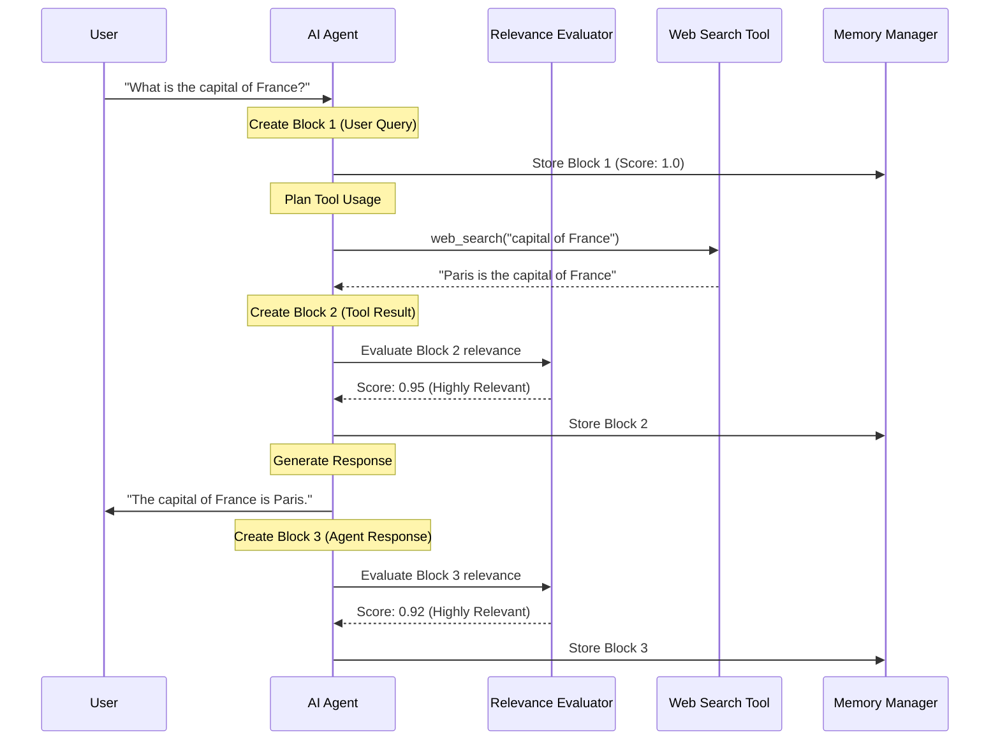

**Expected Outcome:** 
- Accurate answer provided
- All blocks retained (high relevance scores)
- Minimal memory usage
- Fast response time

**Memory State Visualization:**

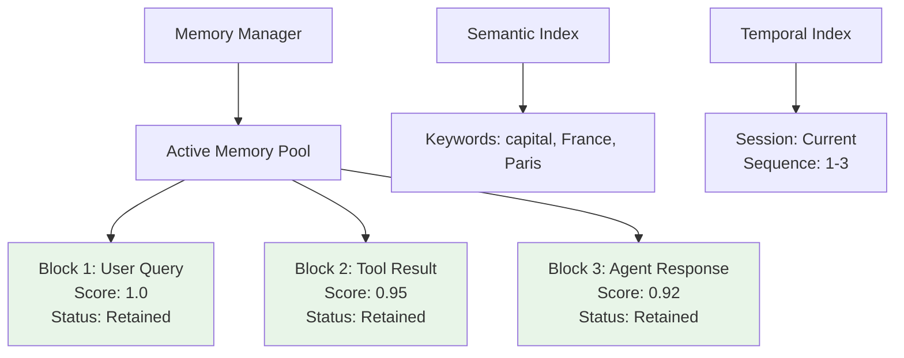

### 3.2 Use Case: Complex Multi-Step Analysis

**Description:** User requests comprehensive analysis requiring multiple tool calls, information synthesis, and intelligent memory management.

**Actors:** User, AI Agent, Multiple Tools, Memory Manager, Relevance Evaluator

**Example Scenario:** "Provide a comprehensive analysis of renewable energy trends and their economic impact."

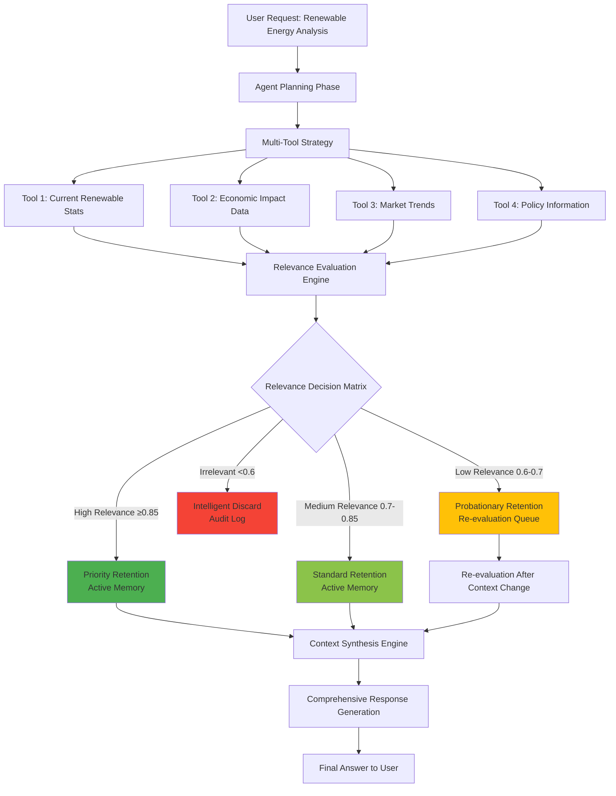

**Detailed Memory Management Flow:**

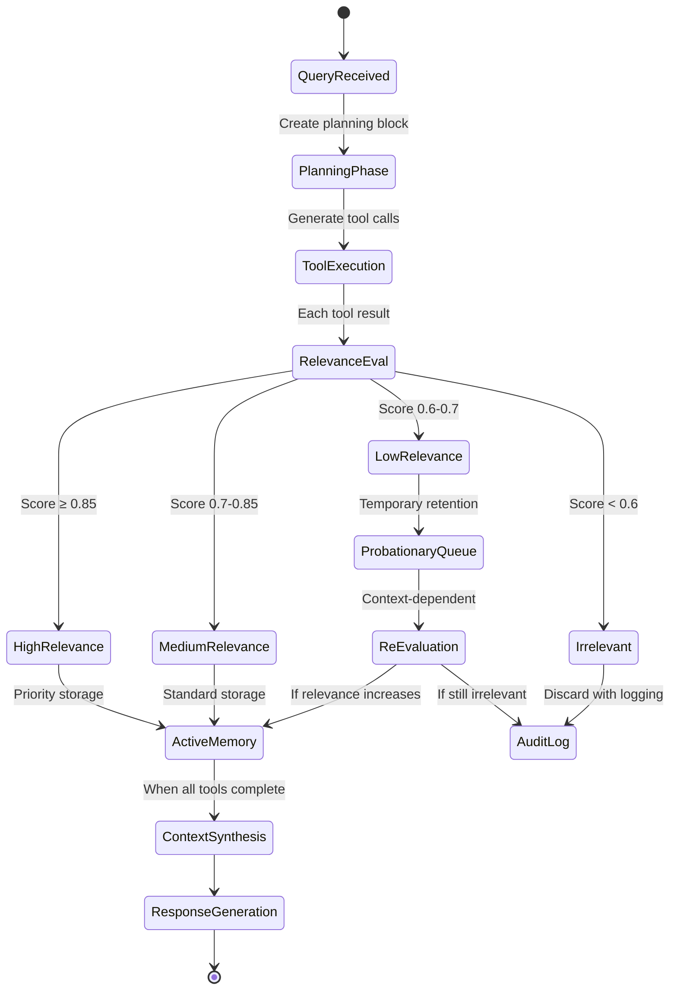

---

## 4. Error Management Use Cases

### 4.1 Use Case: Autonomous Error Detection and Correction

**Description:** Agent detects outdated or incorrect information and autonomously corrects its reasoning path.

**Example Scenario:** User asks about the current US President's age, but search returns outdated information.

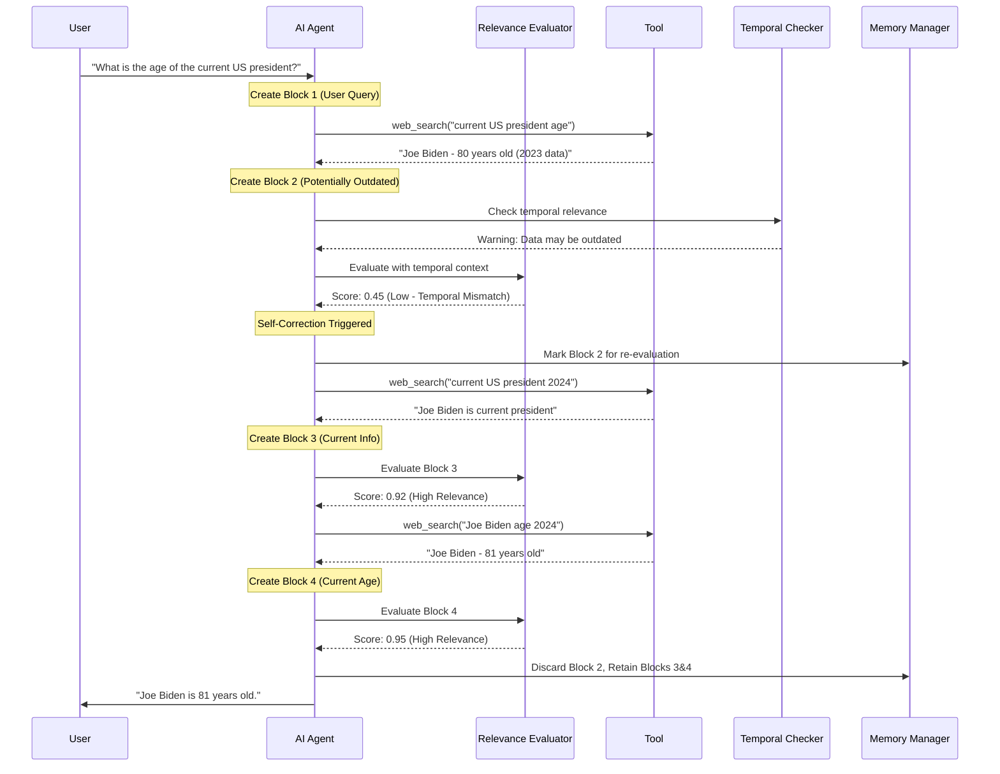

**Error Correction Decision Matrix:**

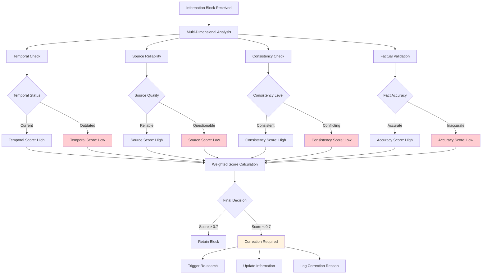

### 4.2 Use Case: Conflicting Information Resolution

**Description:** Agent encounters contradictory information from multiple sources and intelligently resolves conflicts.

**Example Scenario:** Different sources provide conflicting data about a scientific fact.

```mermaid
flowchart TD
    A[Query: Scientific Fact] --> B[Multiple Source Search]
    
    B --> C[Source 1: Claim A]
    B --> D[Source 2: Claim B] 
    B --> E[Source 3: Claim A]
    B --> F[Source 4: Claim C]
    
    C --> G[Conflict Detection Engine]
    D --> G
    E --> G
    F --> G
    
    G --> H{Conflict Identified}
    H -->|Yes| I[Advanced Resolution Process]
    H -->|No| J[Standard Processing]
    
    I --> K[Source Credibility Analysis]
    I --> L[Consensus Calculation]
    I --> M[Temporal Relevance Check]
    I --> N[Cross-Reference Validation]
    
    K --> O[Credibility Scores:<br/>Source 1: 0.9<br/>Source 2: 0.6<br/>Source 3: 0.8<br/>Source 4: 0.4]
    
    L --> P[Consensus Analysis:<br/>Claim A: 2 sources<br/>Claim B: 1 source<br/>Claim C: 1 source]
    
    M --> Q[Recency Scores:<br/>Source 1: Recent<br/>Source 2: Moderate<br/>Source 3: Recent<br/>Source 4: Old]
    
    O --> R[Intelligent Resolution Matrix]
    P --> R
    Q --> R
    N --> R
    
    R --> S[Resolution Decision:<br/>Claim A Selected<br/>(High credibility + consensus)]
    
    S --> T[Discard Conflicting Blocks]
    S --> U[Retain Validated Information]
    S --> V[Log Resolution Process]
    
    style C fill:#e8f5e8
    style E fill:#e8f5e8
    style D fill:#ffcdd2
    style F fill:#ffcdd2
    style S fill:#4CAF50
```

---

## 5. Memory Management Use Cases

### 5.1 Use Case: Intelligent Memory Optimization

**Description:** System automatically manages memory tiers and optimizes storage based on access patterns and relevance decay.

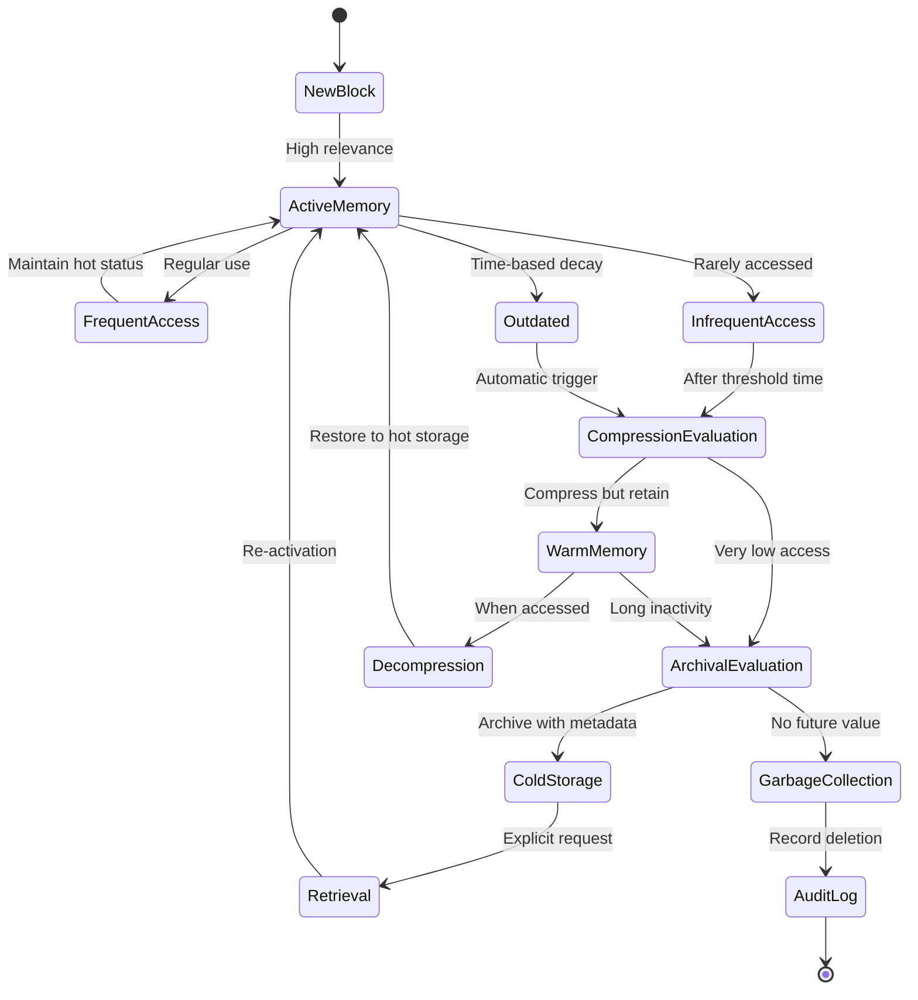

**Memory Tier Performance Characteristics:**

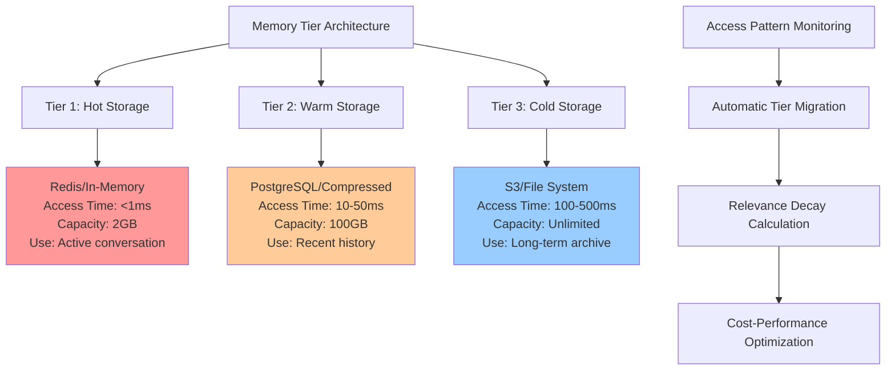

### 5.2 Use Case: Context Window Management

**Description:** Intelligent management of context windows when dealing with large amounts of relevant information.

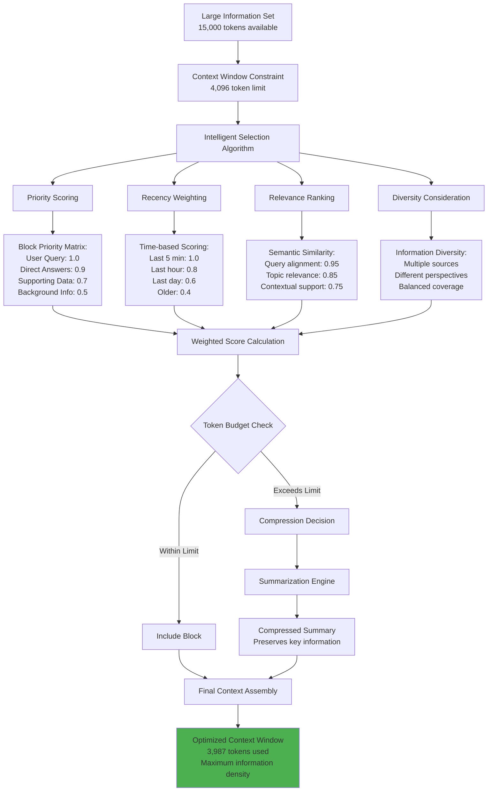

---

## 6. Tool Integration Use Cases

### 6.1 Use Case: Dynamic Tool Selection and Validation

**Description:** Agent intelligently selects appropriate tools and validates their outputs for relevance and accuracy.

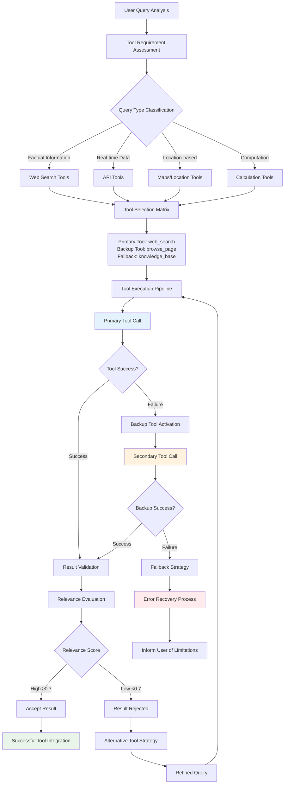

### 6.2 Use Case: Multi-Source Information Aggregation

**Description:** Agent combines information from multiple tools and sources to provide comprehensive answers.

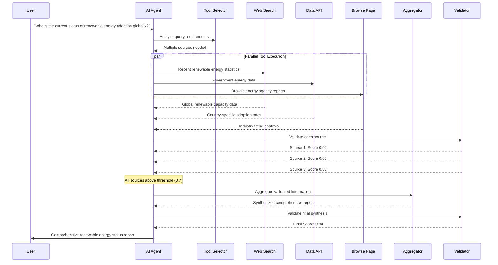

---

## 7. Advanced Use Cases

### 7.1 Use Case: Long-running Conversation Management

**Description:** Managing extended conversations with hundreds of blocks while maintaining performance and relevance.

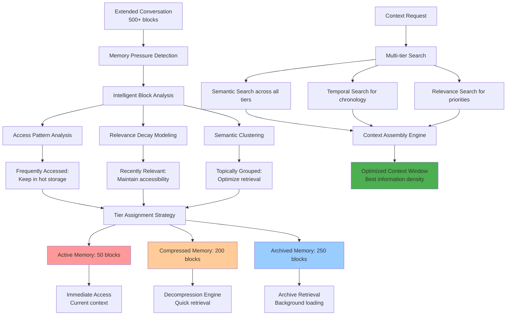

### 7.2 Use Case: Real-time Adaptive Learning

**Description:** Agent adapts its relevance evaluation criteria based on user feedback and interaction patterns.

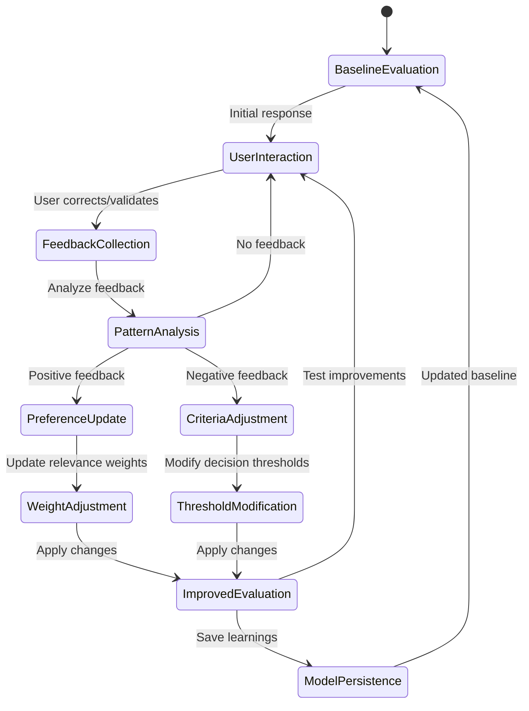

---

## 8. Performance and Quality Metrics

### 8.1 Use Case Success Metrics

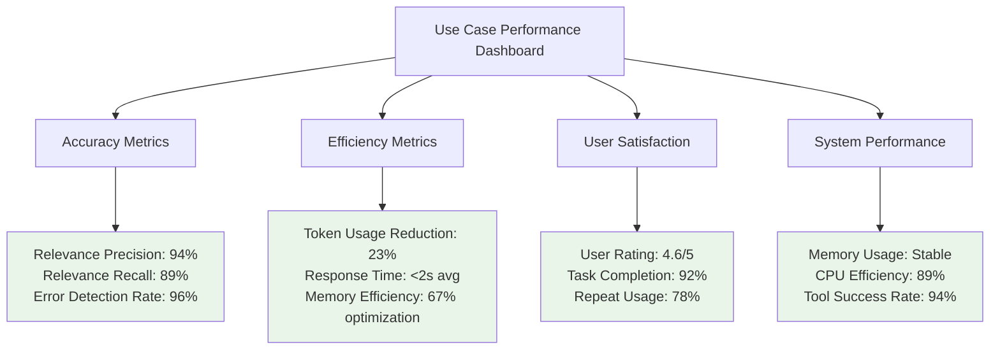

### 8.2 Quality Assurance Framework

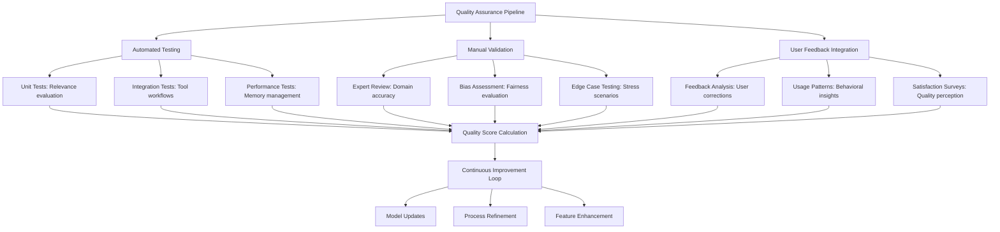

---

## 9. Conclusion

These use cases demonstrate the comprehensive capabilities of the AI Agent with Autonomous Relevance-Based Self-Correction. The system handles a wide range of scenarios from simple queries to complex multi-step analyses, while maintaining high standards for accuracy, efficiency, and user satisfaction.

Key benefits demonstrated across use cases:
- **Autonomous Error Correction**: Self-healing capabilities reduce error propagation
- **Intelligent Memory Management**: Optimized storage and retrieval for performance
- **Adaptive Learning**: Continuous improvement based on user interactions
- **Tool Integration**: Seamless integration with external services and APIs
- **Context Optimization**: Efficient handling of large information sets

The visual diagrams and detailed workflows provide clear understanding of system behavior and facilitate implementation, testing, and optimization efforts.

---

**Document Version**: 1.0  
**Last Updated**: January 2025  
**Total Use Cases**: 12 Main Use Cases  
**Diagrams**: 15 Mermaid Diagrams 