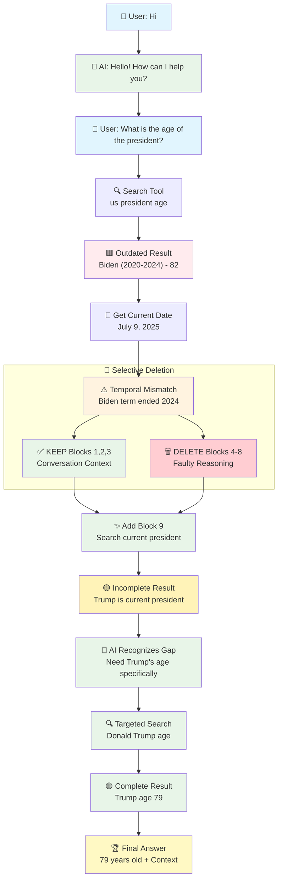
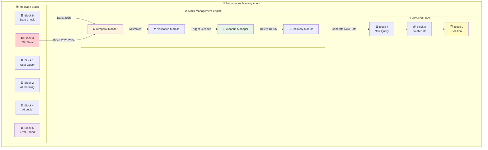

Here is the completed block:

Thought
"""
Check if the implementation detail is applicable for the following use cases.

Normal flow:
<block1>
User: What is the age of the president of the United States?
</block1>
<block2>
AI: I need to use the search tool to find the age of the president of the United States. <tool call - query: us president's age>
</block2>
<block3>
Tool (Search): Trump (2024-Present) - 79 years old
</block3>
<block4>
AI: I should use the get_date tool to find the current date. <tool call - get_date>
</block4>
<block5>
Tool (date): 9th July 2025
</block5>
<block6>
AI: Trump started in 2024 and it is currently 2025, so he is still the president. Therefore, the answer is 79 years old.
</block6>

Alternate flow:
<block1>
User: What is the age of the president of the United States?
</block1>
<block2>
AI: I need to use the search tool to find the age of the president of the United States. <tool call - query: us president's age>
</block2>
<block3>
Tool (Search): Biden (2020-2024) - 82 years old
</block3>
<block4>
AI: I should use the get_date tool to find the current date. <tool call - get_date>
</block4>
<block5>
Tool (date): 9th July 2025
</block5>
<block6>
AI: Biden's term ended in 2024 and it is now 2025, so he is not the current president. This query result is outdated and not relevant. I will delete these blocks and restart with the correct approach.

Tools called:
 Tool (Block Management): Delete Block (1, 2, 3, 4, 5, 6)
 Tool (Block Management): Add Block (AI: I need to search for who is currently the president of the United States in 2025)
</block6>
<block7>
AI: I need to search for who is currently the president of the United States in 2025. <tool call - query: current US president 2025>
</block7>
<block8>
Tool (Search): Trump (2024-Present) - 79 years old
</block8>
<block9>
AI: Trump is the current president as of 2025. Therefore, the answer to the user's question is 79 years old.
</block9>

## Autonomous Intelligent Memory Agent - Self-Correction Framework

### Core Concept:
An AI agent that maintains dynamic reasoning blocks and can autonomously detect, remove, and replace outdated or irrelevant information during its reasoning process.

### Key Features:

1. **Temporal Awareness**: The agent continuously validates information against current dates and contexts
2. **Self-Correction Mechanism**: When detecting outdated information, the agent can delete irrelevant blocks and generate new, accurate reasoning paths
3. **Block Management System**: A structured approach to maintaining coherent reasoning chains while allowing for dynamic updates
4. **Relevance Validation**: Each piece of information is checked for current applicability before being used in final responses

### Use Case Requirements:
- **Robust Temporal Handling**: The system must handle both normal flows (when initial search results are current) and alternate flows (when initial results are outdated)
- **Current Information Verification**: Always cross-reference search results with current date/context to ensure accuracy
- **Intelligent Error Recovery**: When outdated information is detected, the system should recognize the irrelevance, clean up incorrect reasoning blocks, and restart with the correct approach
- **Adaptive Reasoning**: The flow should be robust to changes in context (presidents, dates, etc.), ensuring accurate and up-to-date answers
- **Memory Integrity**: The agent maintains consistency in its reasoning chain while allowing for necessary corrections

### Implementation Benefits:
- Prevents propagation of outdated information
- Maintains user trust through accurate, current responses
- Reduces hallucination by validating information temporally
- Creates self-healing reasoning processes
- Enables long-term conversation consistency

### Edge Cases to Consider:
- Information that changes frequently (stock prices, weather, political positions)
- Partial information updates (when some facts remain current while others become outdated)
- Conflicting sources with different timestamps
- Information that becomes relevant again (cyclical data, recurring events)

## Step-by-Step Message Stack Evolution

### 🎯 Initial State
```
┌─────────────────┐
│  Message Stack  │
│      [ ]        │
│     Empty       │
└─────────────────┘
```

### 👋 Step 1: User Greeting
```
┌─────────────────────────────────────────────────────┐
│                 Message Stack                       │
├─────────────────────────────────────────────────────┤
│ 🟦 Block1: "User: Hi"                              │
└─────────────────────────────────────────────────────┘
```

### 🤖 Step 2: AI Greeting Response
```
┌─────────────────────────────────────────────────────┐
│                 Message Stack                       │
├─────────────────────────────────────────────────────┤
│ 🟦 Block1: "User: Hi"                              │
├─────────────────────────────────────────────────────┤
│ 🟨 Block2: "AI: Hello! How can I help you?"        │
└─────────────────────────────────────────────────────┘
```

### 📝 Step 3: User Query Arrives
```
┌─────────────────────────────────────────────────────┐
│                 Message Stack                       │
├─────────────────────────────────────────────────────┤
│ 🟦 Block1: "User: Hi"                              │
├─────────────────────────────────────────────────────┤
│ 🟨 Block2: "AI: Hello! How can I help you?"        │
├─────────────────────────────────────────────────────┤
│ 🟦 Block3: "User: What is the age of the           │
│           president of the United States?"          │
└─────────────────────────────────────────────────────┘
```

### 🤖 Step 4: AI Plans Search
```
┌─────────────────────────────────────────────────────┐
│                 Message Stack                       │
├─────────────────────────────────────────────────────┤
│ 🟦 Block1: "User: Hi"                              │
├─────────────────────────────────────────────────────┤
│ 🟨 Block2: "AI: Hello! How can I help you?"        │
├─────────────────────────────────────────────────────┤
│ 🟦 Block3: "User: What is the age of the           │
│           president of the United States?"          │
├─────────────────────────────────────────────────────┤
│ 🟨 Block4: "AI: I need to use the search tool to   │
│           find the age of the president..."         │
└─────────────────────────────────────────────────────┘
```

### 🔍 Step 5: Search Returns Outdated Information
```
┌─────────────────────────────────────────────────────┐
│                 Message Stack                       │
├─────────────────────────────────────────────────────┤
│ 🟦 Block1: "User: Hi"                              │
├─────────────────────────────────────────────────────┤
│ 🟨 Block2: "AI: Hello! How can I help you?"        │
├─────────────────────────────────────────────────────┤
│ 🟦 Block3: "User: What is the age of the           │
│           president of the United States?"          │
├─────────────────────────────────────────────────────┤
│ 🟨 Block4: "AI: I need to use the search tool..."   │
├─────────────────────────────────────────────────────┤
│ 🟥 Block5: "Tool (Search): Biden (2020-2024)       │
│           - 82 years old"                           │
└─────────────────────────────────────────────────────┘
```

### 📅 Step 6: AI Gets Current Date
```
┌─────────────────────────────────────────────────────┐
│                 Message Stack                       │
├─────────────────────────────────────────────────────┤
│ 🟦 Block1: "User: Hi"                              │
├─────────────────────────────────────────────────────┤
│ 🟨 Block2: "AI: Hello! How can I help you?"        │
├─────────────────────────────────────────────────────┤
│ 🟦 Block3: "User: What is the age..."              │
├─────────────────────────────────────────────────────┤
│ 🟨 Block4: "AI: I need to use the search tool..."   │
├─────────────────────────────────────────────────────┤
│ 🟥 Block5: "Tool (Search): Biden (2020-2024)..."   │
├─────────────────────────────────────────────────────┤
│ 🟨 Block6: "AI: I should use the get_date tool..." │
└─────────────────────────────────────────────────────┘
```

### ⏰ Step 7: Date Tool Returns Current Date
```
┌─────────────────────────────────────────────────────┐
│                 Message Stack                       │
├─────────────────────────────────────────────────────┤
│ 🟦 Block1: "User: Hi"                              │
├─────────────────────────────────────────────────────┤
│ 🟨 Block2: "AI: Hello! How can I help you?"        │
├─────────────────────────────────────────────────────┤
│ 🟦 Block3: "User: What is the age..."              │
├─────────────────────────────────────────────────────┤
│ 🟨 Block4: "AI: I need to use the search tool..."   │
├─────────────────────────────────────────────────────┤
│ 🟥 Block5: "Tool (Search): Biden (2020-2024)..."   │
├─────────────────────────────────────────────────────┤
│ 🟨 Block6: "AI: I should use the get_date tool..." │
├─────────────────────────────────────────────────────┤
│ 🟩 Block7: "Tool (date): 9th July 2025"            │
└─────────────────────────────────────────────────────┘
```

### ⚠️ Step 8: AI Detects Temporal Mismatch
```
┌─────────────────────────────────────────────────────┐
│                 Message Stack                       │
├─────────────────────────────────────────────────────┤
│ 🟦 Block1: "User: Hi"                              │
├─────────────────────────────────────────────────────┤
│ 🟨 Block2: "AI: Hello! How can I help you?"        │
├─────────────────────────────────────────────────────┤
│ 🟦 Block3: "User: What is the age..."              │
├─────────────────────────────────────────────────────┤
│ 🟨 Block4: "AI: I need to use the search tool..."   │
├─────────────────────────────────────────────────────┤
│ 🟥 Block5: "Tool (Search): Biden (2020-2024)..."   │
├─────────────────────────────────────────────────────┤
│ 🟨 Block6: "AI: I should use the get_date tool..." │
├─────────────────────────────────────────────────────┤
│ 🟩 Block7: "Tool (date): 9th July 2025"            │
├─────────────────────────────────────────────────────┤
│ 🟪 Block8: "AI: Biden's term ended in 2024...      │
│           TEMPORAL MISMATCH DETECTED! 🚨"           │
└─────────────────────────────────────────────────────┘
```

### 🗑️ Step 9: Block Management Tool Selectively Deletes Faulty Reasoning
```
      ❌ SELECTIVE DELETION OPERATION ❌
    
┌─────────────────────────────────────────────────────┐
│ 🗑️  Blocks 4-8 marked for deletion...              │
│     (Keep conversation context & user query)        │
│                                                     │
│ ✅ KEEP: ┌─────┐ ┌─────┐ ┌─────┐                   │
│          │  1  │ │  2  │ │  3  │                   │
│          └─────┘ └─────┘ └─────┘                   │
│            Hi    Hello   Question                   │
│                                                     │
│ 💥 DELETE: ┌─────┐ ┌─────┐ ┌─────┐ ┌─────┐ ┌─────┐│
│            │  4  │ │  5  │ │  6  │ │  7  │ │  8  ││
│            └─────┘ └─────┘ └─────┘ └─────┘ └─────┘│
│               ↓       ↓       ↓       ↓       ↓   │
│              💥     💥     💥     💥     💥  │
└─────────────────────────────────────────────────────┘

┌─────────────────────────────────────────────────────┐
│                 Message Stack                       │
├─────────────────────────────────────────────────────┤
│ 🟦 Block1: "User: Hi"                              │
├─────────────────────────────────────────────────────┤
│ 🟨 Block2: "AI: Hello! How can I help you?"        │
├─────────────────────────────────────────────────────┤
│ 🟦 Block3: "User: What is the age of the           │
│           president of the United States?"          │
└─────────────────────────────────────────────────────┘
```

### ✨ Step 10: Add New Corrected Block 9
```
      ✅ ADDITION OPERATION ✅
    
┌─────────────────────────────────────────────────────┐
│                 Message Stack                       │
├─────────────────────────────────────────────────────┤
│ 🟦 Block1: "User: Hi"                              │
├─────────────────────────────────────────────────────┤
│ 🟨 Block2: "AI: Hello! How can I help you?"        │
├─────────────────────────────────────────────────────┤
│ 🟦 Block3: "User: What is the age of the           │
│           president of the United States?"          │
├─────────────────────────────────────────────────────┤
│ 🟨 Block9: "AI: I need to search for who is        │
│           currently the president of the US in     │
│           2025. <corrected query>"                  │
└─────────────────────────────────────────────────────┘
```

### 🎯 Step 11: New Search Returns Incomplete Information
```
┌─────────────────────────────────────────────────────┐
│                 Message Stack                       │
├─────────────────────────────────────────────────────┤
│ 🟦 Block1: "User: Hi"                              │
├─────────────────────────────────────────────────────┤
│ 🟨 Block2: "AI: Hello! How can I help you?"        │
├─────────────────────────────────────────────────────┤
│ 🟦 Block3: "User: What is the age of the           │
│           president of the United States?"          │
├─────────────────────────────────────────────────────┤
│ 🟨 Block9: "AI: I need to search for who is        │
│           currently the president..."               │
├─────────────────────────────────────────────────────┤
│ 🟡 Block10: "Tool (Search): Trump is the current   │
│            president (2024-Present)" ⚠️ INCOMPLETE │
└─────────────────────────────────────────────────────┘
```

### 🧠 Step 12: AI Recognizes Missing Information & Optimizes
```
┌─────────────────────────────────────────────────────┐
│                 Message Stack                       │
├─────────────────────────────────────────────────────┤
│ 🟦 Block1: "User: Hi"                              │
├─────────────────────────────────────────────────────┤
│ 🟨 Block2: "AI: Hello! How can I help you?"        │
├─────────────────────────────────────────────────────┤
│ 🟦 Block3: "User: What is the age of the           │
│           president of the United States?"          │
├─────────────────────────────────────────────────────┤
│ 🟨 Block9: "AI: I need to search for who is        │
│           currently the president..."               │
├─────────────────────────────────────────────────────┤
│ 🟡 Block10: "Tool (Search): Trump is the current   │
│            president (2024-Present)" ⚠️            │
├─────────────────────────────────────────────────────┤
│ 🟨 Block11: "AI: I found who the president is but  │
│            need his age. Let me search specifically │
│            for Trump's age."                        │
└─────────────────────────────────────────────────────┘
```

### 🔍 Step 13: Targeted Age Search
```
┌─────────────────────────────────────────────────────┐
│                 Message Stack                       │
├─────────────────────────────────────────────────────┤
│ 🟦 Block1: "User: Hi"                              │
├─────────────────────────────────────────────────────┤
│ 🟨 Block2: "AI: Hello! How can I help you?"        │
├─────────────────────────────────────────────────────┤
│ 🟦 Block3: "User: What is the age of the           │
│           president of the United States?"          │
├─────────────────────────────────────────────────────┤
│ 🟨 Block9: "AI: I need to search for who is        │
│           currently the president..."               │
├─────────────────────────────────────────────────────┤
│ 🟡 Block10: "Tool (Search): Trump is the current   │
│            president (2024-Present)"                │
├─────────────────────────────────────────────────────┤
│ 🟨 Block11: "AI: I found who the president is but  │
│            need his age. Let me search specifically │
│            for Trump's age."                        │
├─────────────────────────────────────────────────────┤
│ 🟢 Block12: "Tool (Search): Donald Trump age 79    │
│            years old" ✅ COMPLETE!                  │
└─────────────────────────────────────────────────────┘
```

### 🎉 Step 14: Final Optimized Answer
```
┌─────────────────────────────────────────────────────┐
│                 Message Stack                       │
├─────────────────────────────────────────────────────┤
│ 🟦 Block1: "User: Hi"                              │
├─────────────────────────────────────────────────────┤
│ 🟨 Block2: "AI: Hello! How can I help you?"        │
├─────────────────────────────────────────────────────┤
│ 🟦 Block3: "User: What is the age of the           │
│           president of the United States?"          │
├─────────────────────────────────────────────────────┤
│ 🟨 Block9: "AI: I need to search for who is        │
│           currently the president..."               │
├─────────────────────────────────────────────────────┤
│ 🟡 Block10: "Tool (Search): Trump is the current   │
│            president (2024-Present)"                │
├─────────────────────────────────────────────────────┤
│ 🟨 Block11: "AI: I found who the president is but  │
│            need his age. Let me search specifically │
│            for Trump's age."                        │
├─────────────────────────────────────────────────────┤
│ 🟢 Block12: "Tool (Search): Donald Trump age 79    │
│            years old" ✅                           │
├─────────────────────────────────────────────────────┤
│ 🏆 Block13: "AI: Trump is the current president    │
│            as of 2025, and he is 79 years old."    │
└─────────────────────────────────────────────────────┘
```

## 🎨 Visual Flow Architecture

### Stack Transformation Overview
```
📊 BEFORE CORRECTION          🔄 SELECTIVE CORRECTION    📊 AFTER OPTIMIZATION
┌─────────────────┐          ┌─────────────────┐       ┌─────────────────┐
│ 🟦 Greeting     │   ✅     │ 🟦 Greeting     │   →   │ 🟦 Greeting     │
│ 🟨 AI Response  │   KEEP   │ 🟨 AI Response  │       │ 🟨 AI Response  │
│ 🟦 User Query   │    →     │ 🟦 User Query   │   →   │ 🟦 User Query   │
│ 🟨 AI Reasoning │   💥     │                 │       │ 🟨 New Query    │
│ 🟥 Old Data     │  DELETE  │ ⚠️ TEMPORAL     │       │ 🟡 Partial Info │
│ 🟨 More AI      │   FAULTY │   MISMATCH      │       │ 🟨 Gap Detection│
│ 🟩 Date Check   │  BLOCKS  │  DETECTED       │       │ 🟢 Complete Data│
│ 🟪 Error Found  │          │                 │       │ 🏆 Final Answer │
└─────────────────┘          └─────────────────┘       └─────────────────┘
   8 blocks                  Keep: 1,2,3 Delete: 4-8     8 blocks
```

### 🔄 Self-Correction & Optimization Process Flow



## 🛠️ Key Stack Management Operations

### 🎭 Block Types & Color Coding
```
🟦 USER BLOCKS     - Original user queries and inputs
🟨 AI REASONING    - AI planning and decision making  
🟥 OUTDATED DATA   - Information that's no longer current
🟡 INCOMPLETE DATA - Partial information requiring follow-up
🟩 FRESH DATA      - Current, validated information
🟢 VERIFIED TOOLS  - Tool results marked as current
🟪 ERROR DETECTION - Mismatch identification blocks
🏆 FINAL ANSWERS   - Validated conclusions
```

### ⚙️ Operation Types
```
┌─────────────────────────────────────────────────────┐
│                 OPERATION TYPES                     │
├─────────────────────────────────────────────────────┤
│ 📝 APPEND        │ Adding new blocks (normal flow)  │
│ 🗑️ DELETE_RANGE  │ Remove multiple blocks (cleanup) │
│ 🎯 SELECTIVE_DEL │ Keep context, delete faulty only │
│ 🔄 REPLACE       │ Atomic delete + add operations   │
│ ✅ VALIDATE      │ Check temporal consistency       │
│ 🚨 ALERT         │ Trigger self-correction mode     │
│ 🧠 GAP_DETECT    │ Identify incomplete information   │
│ 🔍 OPTIMIZE      │ Execute targeted follow-up       │
│ 🧹 SMART_CLEANUP │ Preserve valid conversational    │
│                  │ context while removing errors    │
└─────────────────────────────────────────────────────┘
```

### 🚨 Self-Correction Triggers
```
┌─────────────────────────────────────────────────────┐
│                   TRIGGER CONDITIONS                │
├─────────────────────────────────────────────────────┤
│ ⏰ TEMPORAL MISMATCH                                │
│    Data timestamp ≠ current date/context           │
├─────────────────────────────────────────────────────┤
│ 🔗 LOGICAL INCONSISTENCY                           │
│    Conflicting information within blocks           │
├─────────────────────────────────────────────────────┤
│ 🎯 RELEVANCE CHECK                                 │
│    Information no longer applicable to query       │
├─────────────────────────────────────────────────────┤
│ 🟡 INCOMPLETE INFORMATION                          │
│    Partial data requiring additional queries       │
├─────────────────────────────────────────────────────┤
│ 📊 SOURCE RELIABILITY                              │
│    Detecting unreliable or outdated sources        │
└─────────────────────────────────────────────────────┘
```

### 🎯 Success Metrics
```
✅ ACCURACY:      Current information only
✅ CONSISTENCY:   No contradictory blocks  
✅ EFFICIENCY:    Minimal corrective cycles
✅ OPTIMIZATION:  Recognizes and fills information gaps
✅ TRANSPARENCY:  Clear correction reasoning
✅ RELIABILITY:   Robust temporal validation
✅ ADAPTABILITY:  Multi-stage intelligent search refinement
```

## 🏗️ System Architecture Overview

### 🔧 Block Management Engine



### ✨ The Beauty of Self-Correction

This autonomous intelligent memory agent represents a paradigm shift in AI reasoning:

🎭 **Dynamic Intelligence**: Unlike static reasoning chains, this system actively monitors and corrects itself in real-time

🧠 **Temporal Awareness**: The agent doesn't just process information—it validates its currency and relevance

🔧 **Self-Healing**: When errors are detected, the system doesn't just flag them—it autonomously repairs the reasoning path

🎯 **Precision**: Every block is purposeful, current, and contributes to an accurate final answer

The visual journey from **8 conversational blocks** → **selective cleanup** → **8 optimized blocks** illustrates the power of intelligent self-correction and optimization in action!

### 💫 Conversation Flow Highlights:
- **👋 Greeting Exchange**: Natural conversation starts with polite greeting
- **🔍 Knowledge Retrieval**: System searches for information as requested  
- **⚠️ Error Detection**: Temporal mismatch triggers self-correction
- **🎯 Smart Cleanup**: Only faulty reasoning removed, context preserved
- **🟡 Gap Recognition**: AI identifies incomplete information automatically
- **🧠 Intelligent Optimization**: Executes targeted follow-up searches
- **🏆 Accurate Result**: User gets correct, complete answer with full context

### 🧠 Advanced Intelligence Highlights:
- **Context Preservation**: Keeps blocks 1, 2, 3 (greeting + query)
- **Selective Deletion**: Removes only blocks 4-8 (faulty reasoning)
- **Seamless Recovery**: Adds block 9 with corrected approach
- **Information Gap Detection**: Recognizes when data is incomplete (Block 10)
- **Optimization Intelligence**: Self-initiates additional searches (Block 11)
- **Iterative Refinement**: Continues until complete information is obtained
- **Natural Flow**: Final answer maintains conversational continuity

### 🚀 Multi-Stage Intelligence:
- **Stage 1**: Temporal error correction (outdated → current)
- **Stage 2**: Information gap detection (incomplete → targeted search)
- **Stage 3**: Search optimization (partial → complete data)
- **Stage 4**: Contextual synthesis (all information → final answer)

The autonomous agent demonstrates **surgical precision** in error correction, **intelligent optimization** in information gathering, and **conversational continuity** throughout the entire process!

"""